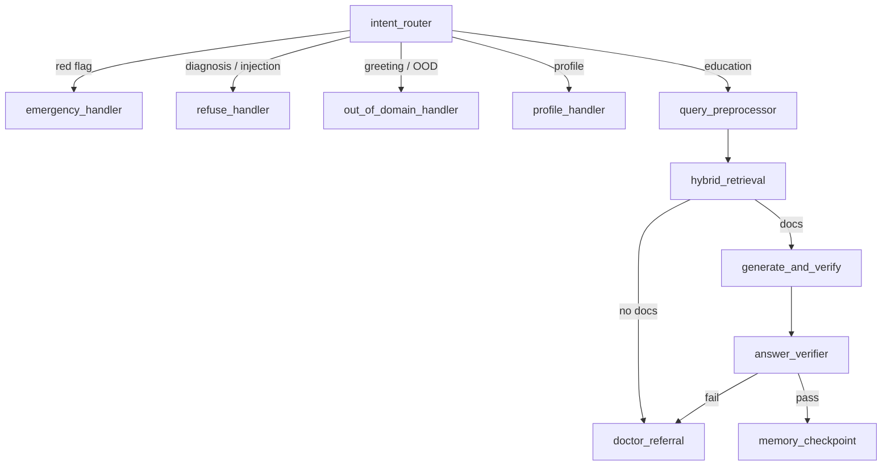
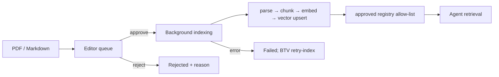

# Kiến trúc hiện trạng — EduHealth AI

> Cập nhật theo code đang có ngày 31/08/2026. Đây là tài liệu kiến trúc chuẩn
> của repository; sơ đồ có thể render xem tại
> [architecture-diagram.md](architecture-diagram.md). Tài liệu Gate 1 giữ vai
> trò lịch sử/yêu cầu ban đầu, không dùng để khẳng định một component đã chạy.

## 1. Mục tiêu và ranh giới

EduHealth AI là trợ lý **giáo dục sức khỏe** bằng tiếng Việt. Agent chỉ sử dụng
tài liệu y khoa đã duyệt để trả lời có citation; không chẩn đoán, kê đơn hoặc
điều chỉnh liều. Khi evidence không đủ, agent fail-closed về doctor_referral
thay vì suy đoán.

Hệ thống hiện có ba vai trò do backend gán qua JWT:

| Vai trò | Trách nhiệm chính |
| --- | --- |
| patient | Hồ sơ, chat AI/voice, nguồn trích dẫn, học tập/quiz, thông báo, chọn bác sĩ và tham gia tư vấn |
| editor | BTV/admin: quản lý tài liệu, bệnh áp dụng, queue index, content gap, phản hồi bệnh nhân và hồ sơ bác sĩ |
| doctor | Cập nhật hồ sơ chuyên môn, nhận thông báo, nhắn tin và gọi video trong các phiên được gán |

## 2. Thành phần triển khai

| Tầng | Thành phần | Trách nhiệm |
| --- | --- | --- |
| Client | React 19, Vite, TypeScript, Tailwind | Một SPA với route guard theo vai trò; SSE cho chat; Web Audio, WebRTC trong trình duyệt |
| API | FastAPI /api/v1 | JWT/RBAC, validation Pydantic, REST/SSE, upload và orchestration workflow |
| Agent | LangGraph StateGraph | Điều phối safety → context → retrieval → generation → verification |
| RAG | Parser, chunker, embedder, VectorStore | Lập chỉ mục tài liệu và chỉ truy xuất nguồn approved |
| Data | SQLite dev / PostgreSQL production | Người dùng, hồ sơ, chat, routine, nội dung, queue, thông báo, phiên tư vấn và WebRTC signal |
| Vector data | Chroma local / pgvector PostgreSQL | Chunks + embedding; backend tự chọn theo loại DATABASE_URL |
| External AI | Groq, OpenAI, OpenRouter; Cohere/OpenAI/local embeddings | LLM có fallback runtime; STT/TTS dùng OpenAI; embedding có timeout/rate-limit |

Không có Redis, Qdrant, BM25, cross-encoder reranker hay CRAG node trong code
hiện tại. Các mục này chỉ là roadmap, không phải dependency production.

## 3. LangGraph v2

Graph được compile một lần trong src/agent/graph.py; persistence hội thoại nằm ở
API/database, không dùng LangGraph checkpointer.

### 3.1. Safety và routing

1. intent_router chạy guardrail theo luật trước; red flag, prompt injection và
   yêu cầu chẩn đoán không đi vào retrieval.
2. Fast LLM trả intent, scope, task_kind; timeout/lỗi router fail-open về
   education, còn luật safety đã xử lý trước đó.
3. query_preprocessor nhận hồ sơ, 6 message gần nhất và routine để rewrite
   truy vấn, resolve ngữ cảnh và trích routine update có evidence nguyên văn.

### 3.2. Retrieval và grounding

hybrid_retrieval là tên node giữ tương thích API, nhưng hiện thực hiện dense
vector search. Nó:

- lọc allow-list từ registry của SourceDocument đã approved;
- áp metadata bệnh chính và bệnh đồng mắc khi có;
- dùng min_similarity, top_k_fetch và top_k từ RagSettings;
- chạy trong thread với timeout, lỗi/timed out dẫn về referral;
- lưu query chuẩn hóa, hit score và timing trong messages.meta_data.

generate_and_verify chỉ chấp nhận citation marker trỏ đến chunk đã được đưa
vào context. answer_verifier là lượt quality LLM tách riêng, fail-closed khi
lạc đề hoặc không grounded. SSE chỉ phát text sau khi toàn graph hoàn thành;
annotation thuật ngữ được chạy sau done để không tăng thời gian chờ câu trả lời
chính.

### 3.3. Memory và dữ liệu bệnh nhân

- Hồ sơ chính thức lấy từ bảng patients.
- Lịch sử đưa vào AgentState là 6 message gần nhất.
- Routine bền vững nằm ở patient_routine_memories, tối đa 24 fact. Backend chỉ
  lưu evidence xuất hiện nguyên văn trong câu người bệnh.
- Routine/hồ sơ chỉ cá nhân hóa; không bao giờ là source citation.
- memory_checkpoint hiện chỉ đánh dấu hoàn tất graph. API là nơi lưu chat,
  routine update, audit metadata và tạo workflow BTV nếu phù hợp.

## 4. Nội dung y khoa và BTV

Chỉ sau khi index thành công và document ở trạng thái approved, chunk mới được
phép dùng. Tài liệu draft/pending/indexing/failed/rejected không xuất hiện
trong citation của bệnh nhân.

Khi referral xảy ra **sau retrieval thành công nhưng thiếu knowledge**,
record_unanswered_patient_question tạo đồng thời:

- OutOfScopeLog: thống kê content gap đã aggregate, không dùng để phản hồi cá nhân;
- PatientEditorialQuestion: yêu cầu riêng cho bệnh nhân;
- BTV trả lời tạo PatientNotification trong inbox của đúng bệnh nhân.

Phản hồi BTV không tự đi vào RAG. Muốn mở rộng knowledge base, BTV phải tạo/tải
tài liệu và duyệt theo workflow ở trên.

## 5. Bác sĩ và tư vấn trực tiếp

Consultation là domain tách biệt với chat AI. Bệnh nhân chọn một hồ sơ bác sĩ
công khai, tạo phiên requested; bác sĩ nhận notification, chấp nhận thành
active, và hai phía nhắn tin trong đúng phiên đó.

Video call dùng WebRTC. FastAPI chỉ phục vụ authorization, lifecycle của call
và exchange offer/answer/ICE; bytes camera/micro đi trực tiếp giữa hai browser.
Gọi khác mạng cần STUN/TURN trong WEBRTC_ICE_SERVERS; app không tự biến API
server thành TURN server.

## 6. Triển khai và vận hành

- Dev: Vite ở 5180, FastAPI ở 8000, SQLite hoặc PostgreSQL; Vite proxy /api
  sang backend.
- Production: frontend có Dockerfile/Caddyfile riêng; backend FastAPI và
  PostgreSQL/pgvector có thể triển khai tách. Cần persistent storage/database
  cho uploads, runtime registry và chunks.
- Startup kiểm tra readiness của vector store. Kho rỗng/hỏng không làm app
  chết, nhưng mọi câu education sẽ fail-closed về referral.
- LangSmith có thể trace LangChain/LangGraph qua environment; timing node cũng
  được log và gửi trong SSE done.

## 7. Quyết định kỹ thuật và trạng thái

| Quyết định | Hiện trạng | Lý do |
| --- | --- | --- |
| Safety trước retrieval | Đã triển khai | Không để red flag/chẩn đoán/injection chạm RAG hoặc LLM quality |
| Citation + independent verifier | Đã triển khai | Hạn chế hallucination và câu trả lời lệch nguồn |
| Dense retrieval | Đã triển khai | Có threshold và approved allow-list; cần eval để hiệu chỉnh |
| Chroma/pgvector dual mode | Đã triển khai | Local dễ chạy với Chroma; Postgres production không cần mount Chroma index |
| Direct BTV response | Đã triển khai | Đóng vòng phản hồi bệnh nhân mà không làm ô nhiễm RAG |
| Bác sĩ + WebRTC signaling | Đã triển khai | Tách tư vấn người thật khỏi agent; media không qua backend |
| BM25/rerank/CRAG | Chưa triển khai | Cần đánh giá recall/latency trước khi thêm |
| LangGraph HITL/checkpointer | Chưa triển khai | Chỉ thêm khi cần pause/resume review với persistent store và chính sách PHI |

## 8. Đối chiếu với tài liệu yêu cầu

`docs/gate1/brief.md` và `docs/gate1/prd.md` là baseline yêu cầu Gate 1. Bảng
dưới đây nói rõ phần nào đã được kiến trúc hiện tại đáp ứng, phần nào đã mở rộng
sau Gate 1, và phần nào chưa được triển khai để tài liệu không mô tả roadmap như
chức năng đang chạy.

| Yêu cầu | Thành phần hiện tại | Trạng thái |
| --- | --- | --- |
| Câu trả lời grounded, có trích dẫn nguồn | approved-document allow-list, citation parser, `answer_verifier` | Đã triển khai |
| Cá nhân hóa theo hồ sơ và đa bệnh nền | `patients`, profile-aware preprocessing, routine memory có evidence | Đã triển khai |
| Red flag trước nội dung giáo dục; không chẩn đoán/kê đơn | `intent_router` rule-first → emergency/refuse handler trước retrieval | Đã triển khai; cần tiếp tục đánh giá recall guardrail |
| BTV duyệt nội dung và mở rộng thư viện | editor queue → index → approved registry; content-gap workflow | Đã triển khai |
| Log câu hỏi thiếu kiến thức | `OutOfScopeLog` aggregate và `PatientEditorialQuestion` riêng | Đã triển khai |
| Hiệu năng/độ tin cậy | timeout node, provider fallback, retrieval timeout, readiness check | Đã triển khai một phần; chưa có SLO/metrics production |
| Hybrid keyword retrieval và reranker nêu trong Gate 1 | Chỉ dense retrieval trong `hybrid_retrieval` | Chưa triển khai; không được mô tả là đã có |

Các thay đổi sau Gate 1 được coi là **mở rộng phạm vi có kiểm soát**: React/Vite
thay cho lựa chọn UI dự kiến Next.js/Streamlit; role `doctor`, consultation chat
và WebRTC video được thêm nhưng tách khỏi agent. Các thay đổi này không nới lỏng
ba ràng buộc gốc: nguồn đã duyệt, cá nhân hóa và không chẩn đoán/kê đơn.

## 9. Tài liệu liên quan

- [Sơ đồ kiến trúc chi tiết](architecture-diagram.md)
- [Luồng LangGraph](langgraph-v2.md)
- [Đặc tả chức năng và UI](functional-spec.md)
- [API contract](api-contract.md)
- [Nhật ký tuần](weekly-log.md)

Khi thêm component mới, cập nhật architecture-diagram.md, tài liệu API/functional
tương ứng và weekly log trong cùng pull request.
