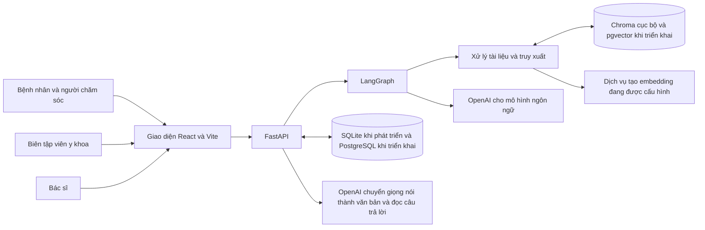
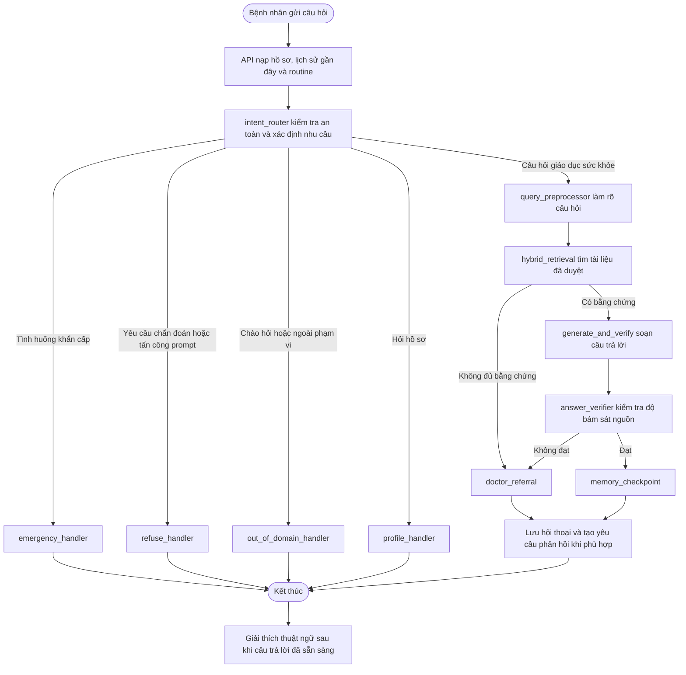
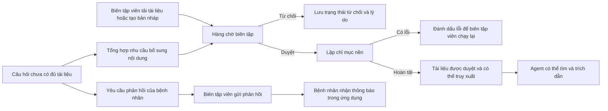
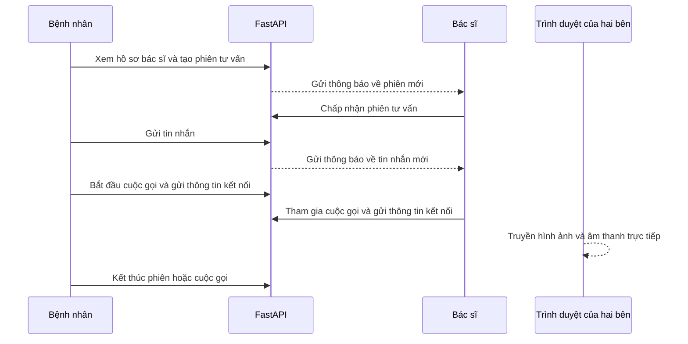

# Sơ đồ kiến trúc EduHealth AI

Tài liệu này mô tả kiến trúc đang có trong mã nguồn. Những hướng phát triển như
tìm kiếm từ khóa, mô hình xếp hạng lại kết quả và vòng sửa truy xuất chưa phải là
thành phần của hệ thống hiện tại.

Hệ thống hiện dùng OpenAI làm nhà cung cấp mô hình ngôn ngữ. OpenAI cũng được
dùng cho chuyển giọng nói thành văn bản và đọc câu trả lời trong voice chat.

## Bức tranh tổng thể

Người dùng làm việc trên cùng một ứng dụng web. FastAPI tiếp nhận yêu cầu,
kiểm tra quyền truy cập và lưu dữ liệu nghiệp vụ. Những câu hỏi dành cho trợ lý
được chuyển vào LangGraph. Agent dùng tài liệu đã duyệt trong kho tri thức rồi
mới tạo câu trả lời.

Hệ thống dùng Chroma khi chạy trên máy cá nhân với SQLite. Khi cơ sở dữ liệu là
PostgreSQL, kho vector dùng pgvector. Việc lựa chọn này giúp môi trường phát
triển đơn giản nhưng vẫn có hướng triển khai phù hợp khi có nhiều người dùng.

## Luồng xử lý một câu hỏi

Luồng này đặt an toàn trước tốc độ trả lời. Câu hỏi có dấu hiệu khẩn cấp được
chuyển sang hướng dẫn cần thiết ngay từ đầu. Với câu hỏi giáo dục sức khỏe,
agent chỉ dùng các đoạn tài liệu đã được duyệt. Nếu không tìm được bằng chứng,
nếu trích dẫn không hợp lệ hoặc bước kiểm tra không đạt, hệ thống không suy
đoán mà khuyến nghị bệnh nhân gặp bác sĩ.

Hồ sơ và routine của bệnh nhân được dùng để cá nhân hóa cách trả lời. Chúng
không thay thế tài liệu y khoa và không bao giờ được dùng làm nguồn trích dẫn.

## Vòng đời tài liệu và phản hồi của biên tập viên

Tài liệu chỉ được đưa vào kho tri thức sau khi hoàn thành việc lập chỉ mục và
được duyệt. Tài liệu đang soạn, đang chờ duyệt, bị từ chối hoặc gặp lỗi không
thể xuất hiện trong nguồn trích dẫn của bệnh nhân.

Khi agent chưa thể trả lời vì thư viện thiếu nội dung, hệ thống có thể tạo một
yêu cầu riêng cho người bệnh đã hỏi. Phản hồi trực tiếp của biên tập viên được
gửi dưới dạng thông báo. Phản hồi đó không tự động trở thành kiến thức chung.
Muốn dùng cho các câu hỏi sau, biên tập viên vẫn cần đưa tài liệu qua quy trình
duyệt và lập chỉ mục.

## Tư vấn với bác sĩ

Một bệnh nhân có thể tư vấn với nhiều bác sĩ. Một bác sĩ cũng có thể nhận nhiều
phiên tư vấn. Chỉ bệnh nhân và bác sĩ thuộc cùng một phiên được đọc hoặc gửi tin
nhắn, cũng như tham gia cuộc gọi của phiên đó.

Hình ảnh và âm thanh của cuộc gọi được truyền trực tiếp giữa hai trình duyệt.
FastAPI chỉ lưu trạng thái phiên và chuyển thông tin để hai bên kết nối. Khi gọi
qua các mạng khác nhau, môi trường triển khai cần có máy chủ TURN để cuộc gọi ổn
định.

## Ranh giới dữ liệu

Hồ sơ bệnh nhân, hội thoại, routine, thông báo và phiên tư vấn được lưu ở
SQLite khi phát triển hoặc PostgreSQL khi triển khai. Bệnh nhân chỉ được xem dữ
liệu của chính mình. Biên tập viên quản lý nội dung và hồ sơ bác sĩ. Bác sĩ chỉ
xem các phiên tư vấn được gán cho mình.

Kho vector lưu các đoạn tài liệu y khoa. Agent chỉ dùng nội dung thuộc tài liệu
đã được duyệt. Routine là thông tin bệnh nhân tự cung cấp, được lưu khi có bằng
chứng nguyên văn trong câu nói của họ và không được coi là nguồn y khoa.

Âm thanh của voice chat được gửi tới dịch vụ chuyển giọng nói thành văn bản.
Hệ thống dùng phần văn bản này để xử lý câu hỏi, không lưu tệp âm thanh. Dữ liệu
theo dõi kỹ thuật được giữ trong log ứng dụng và thông tin audit nội bộ, không
hiển thị cho bệnh nhân.

## Hướng phát triển tiếp theo

Những hướng cần cân nhắc sau khi hoàn thiện evaluation gồm tìm kiếm từ khóa kết
hợp truy xuất ngữ nghĩa, xếp hạng lại các đoạn tài liệu, cơ chế sửa truy xuất,
bộ nhớ bền vững của LangGraph, bộ nhớ đệm kết quả và cơ chế bảo vệ khi nhà cung
cấp mô hình gặp sự cố. Các hướng này chưa được tính là chức năng đã hoàn thành.
