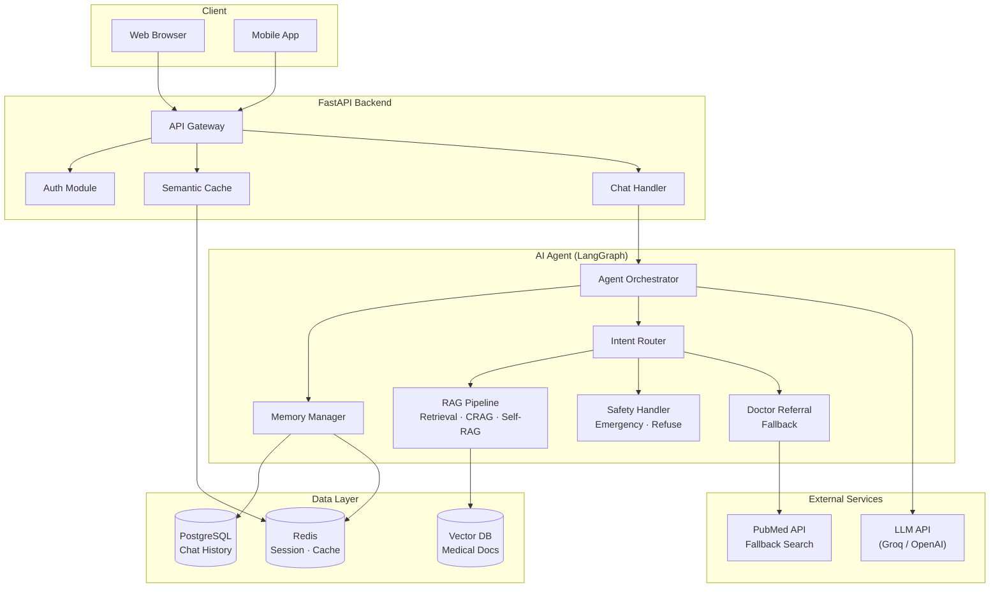
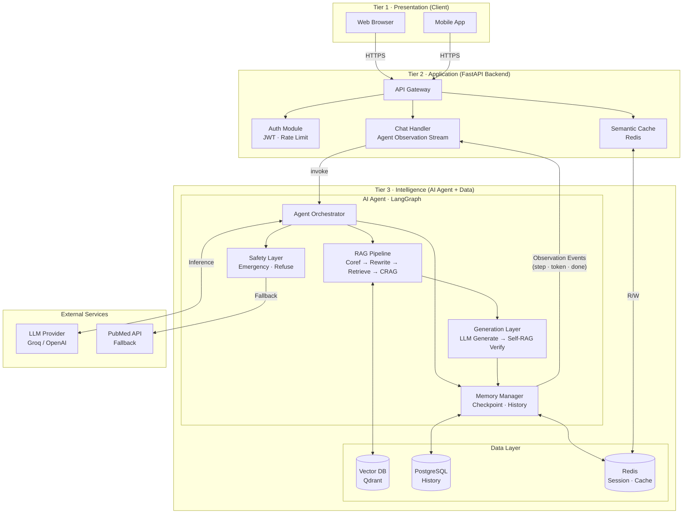
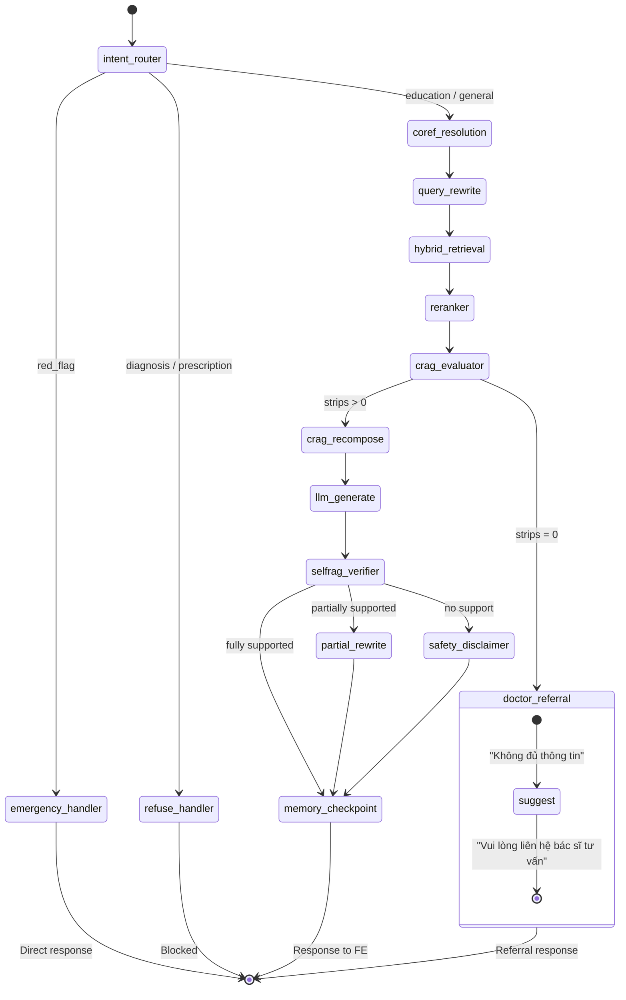
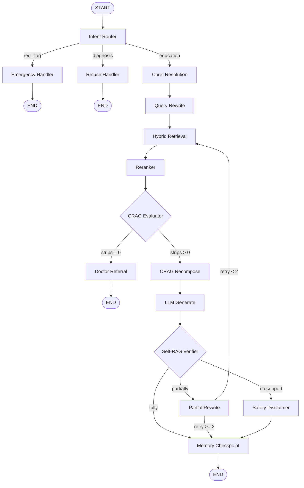
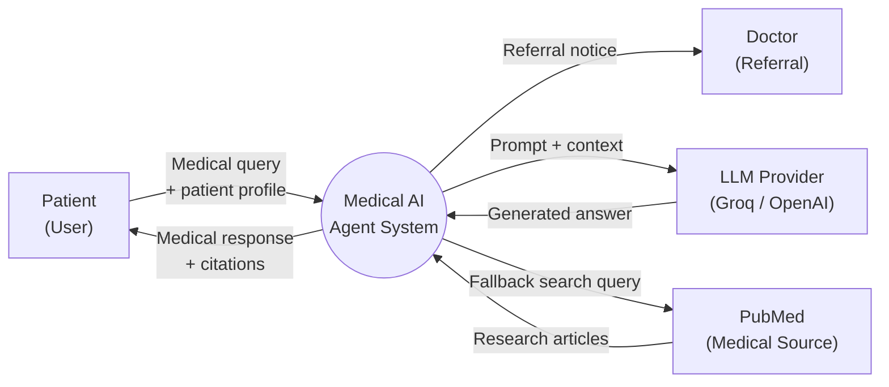
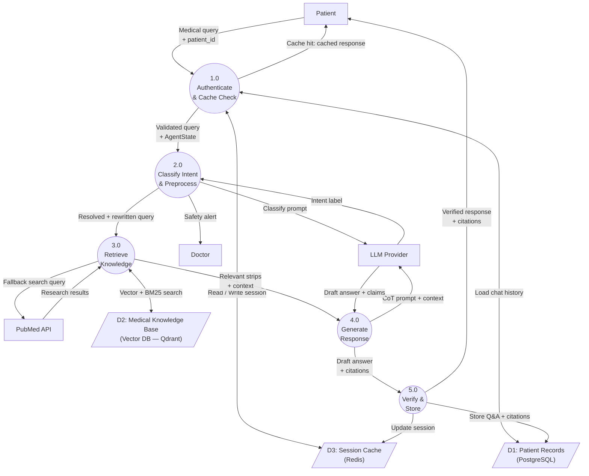
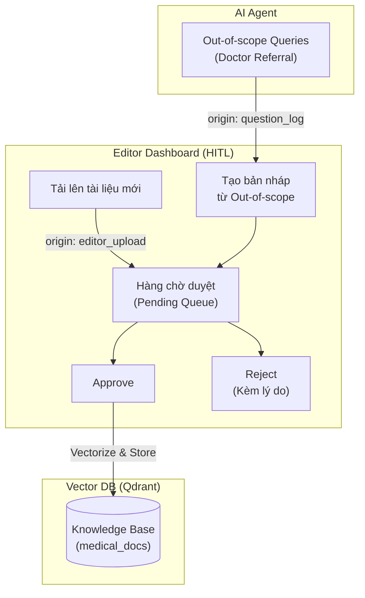
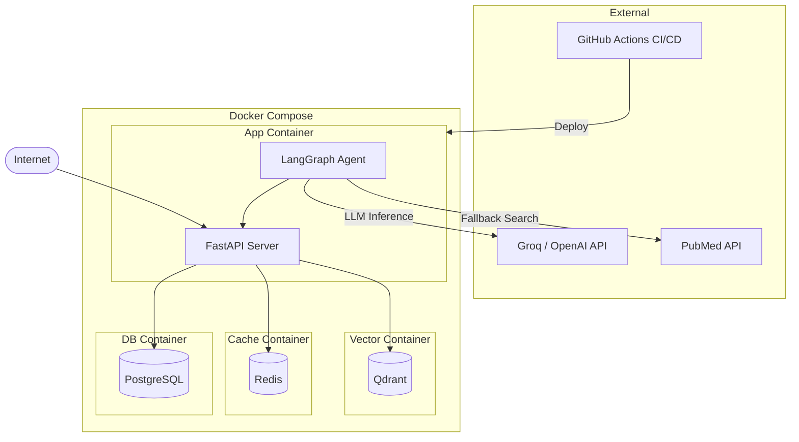

# Architecture Document

## System Overview

Hệ thống là một Medical AI Agent được xây dựng trên kiến trúc 3 tầng (Client → FastAPI Backend → AI Agent + Data Layer), sử dụng LangGraph làm AI Orchestration Engine với pipeline RAG nâng cao tích hợp CRAG, Self-RAG và Safety Guardrails chuyên biệt cho lĩnh vực Y tế. Agent được phân loại theo pattern Router Agent + RAG Agent, phù hợp với bài toán hỏi đáp y tế có nhiều loại intent khác nhau (giáo dục, khẩn cấp, chẩn đoán).

## Architecture Diagram

### System Overview Diagram



### Kiến trúc 3 Tầng



| Tầng                      | Trách nhiệm                           | Thành phần                                         |
| :------------------------ | :------------------------------------ | :------------------------------------------------- |
| **Tier 1** · Client       | Giao diện người dùng, nhận Observation Stream | Web Browser · Mobile App                           |
| **Tier 2** · Backend      | Auth, caching, điều phối request      | API Gateway · Auth · Semantic Cache · Chat Handler |
| **Tier 3** · Intelligence | Xử lý AI + lưu trữ toàn bộ dữ liệu    | LangGraph Agent · Qdrant · PostgreSQL · Redis      |

## Components

### 1. Frontend (Vite + React + TypeScript)

- **Purpose:** Giao diện người dùng tương tác với Medical AI Agent — hiển thị tiến trình xử lý từng bước của Agent, câu trả lời được xác thực và lịch sử hội thoại.
- **Tech Stack thực tế:**
  - `Vite 8 + React 19 + TypeScript 6` — framework chính
  - `react-router-dom v7` — định tuyến giữa các trang
  - `@tanstack/react-query v5` — fetch data, cache state server-side
  - `react-hook-form + Zod` — form validation (tạo hồ sơ bệnh nhân)
  - `Tailwind CSS v4` — styling
  - `msw` — mock API khi backend chưa sẵn, giúp FE phát triển độc lập
- **Key Features:**
  - Chat Interface với Agent Observation Stream — hiển thị `step` events (trạng thái xử lý) và `token` events (text kết quả) theo thời gian thực
  - Dashboard: lịch sử hội thoại, số lượng token, thời gian phản hồi từng bước
  - Hỗ trợ đa nền tảng: Web Browser và Mobile App
- **Dev server:** Port `5180`, proxy `/api` → `http://localhost:8000`
- **Lý do chọn Vite thay vì Next.js:** Ứng dụng y tế yêu cầu đăng nhập — SEO không cần thiết. Vite nhẹ hơn, khởi động nhanh hơn và phù hợp hơn cho SPA cần SSE streaming.

### 2. Backend (FastAPI)

- **Purpose:** Tầng trung gian điều phối toàn bộ request từ Client đến AI Agent — xử lý bảo mật, cache có ngữ cảnh và Agent Observation Stream.
- **API Design:** RESTful + SSE (Server-Sent Events) với Agent Observation Stream
- **Authentication:** JWT Token · Rate Limiting per user
- **Key Modules:**
  - `API Gateway`: Tiếp nhận và validate request đầu vào
  - `Auth Module`: Xác thực JWT, phân quyền, rate limit
  - `Semantic Cache`: Kiểm tra cache với **composite key = `Vector(query)` + `hash(patient_profile)`**. Chỉ cache query dạng `general_education` (không phụ thuộc hồ sơ cá nhân). Query dạng `personalized` (liên quan liều thuốc, bệnh nền cụ thể) **bắt buộc bypass cache** và đi qua RAG Agent để tránh trả về kết quả sai cho bệnh nhân khác nhau.
  - `Chat Handler`: Điều phối request tới LangGraph Agent, phát **Agent Observation Stream** (3 loại event: `step`, `token`, `done`) về FE theo thời gian thực

### 3. AI Agent (LangGraph)

- **Agent Type:** Router Agent + RAG Agent
- **State:** `AgentState` TypedDict — lưu toàn bộ context qua các node

```python
class AgentState(TypedDict, total=False):
    # Input
    query: str
    patient_id: str
    patient_profile: PatientProfile
    messages: List[Message]
    # Routing
    intent: Literal["education", "red_flag", "diagnosis"]
    is_red_flag: bool
    # Preprocessing
    resolved_query: str
    rewritten_query: str
    # Retrieval
    retrieved_docs: List[Document]
    relevant_strips: List[Strip]
    # Generation
    analysis: str
    response: str
    citations: List[Citation]
    # Verification
    support_level: Literal["fully", "partially", "no_support"]
    unsupported_sentences: List[str]
    # Meta
    error: Optional[str]
    metadata: dict
```

- **Nodes & Pipeline Execution (Chi tiết luồng xử lý):**

Quá trình suy luận của AI Agent không diễn ra trong một bước duy nhất mà được chia thành 4 giai đoạn cụ thể thông qua 13 node của LangGraph:

**Giai đoạn 1: Phân loại Ý định & Safety Guardrails (Intent Routing)**
- `intent_router`: Đóng vai trò là "lễ tân", đánh giá câu hỏi bằng rule-based (chạy cực nhanh) kết hợp LLM nhỏ để xác định đúng intent.
- `emergency_handler`: Node cướp quyền điều khiển nếu phát hiện dấu hiệu nguy hiểm tính mạng (khó thở, đau tim). Node này trả về cảnh báo gọi cấp cứu 115 ngay lập tức và **đảm bảo không lưu bất kỳ PII (thông tin định danh) nào vào Database**.
- `refuse_handler`: Chặn đứng mọi câu hỏi có tính chất nhờ chẩn đoán bệnh hoặc kê đơn thuốc (tuân thủ nguyên tắc FR3.4 về an toàn y khoa).

**Giai đoạn 2: Tiền xử lý & Cá nhân hóa (Preprocessing & Personalization)**
- `coref_resolution`: Giải quyết vấn đề mất ngữ cảnh bằng cách thay thế đại từ ("bệnh này", "thuốc đó") bằng thực thể cụ thể từ lịch sử chat.
- `query_rewrite`: Điểm nhấn của **Cá nhân hóa sâu (Deep Personalization)**. Node này tự động "tiêm" (inject) thông tin từ hồ sơ bệnh nhân (tuổi, bệnh nền, thuốc đang dùng) vào câu hỏi gốc để định hướng việc tìm kiếm và sinh câu trả lời cho phù hợp với thể trạng riêng biệt của từng người.

**Giai đoạn 3: Truy xuất & Đánh giá tài liệu (Retrieval & CRAG)**
- `hybrid_retrieval`: Kết hợp tìm kiếm theo từ khóa (BM25 - tốt cho tên thuốc) và tìm kiếm theo ngữ nghĩa (Dense Vector - tốt cho mô tả triệu chứng) trên Qdrant.
- `reranker`: Chấm điểm lại (Cross-encoder scoring) để đưa các tài liệu liên quan nhất lên đầu.
- `crag_evaluator` & `crag_recompose`: Thực thi luồng **Corrective RAG (CRAG)**. Đánh giá từng đoạn tài liệu xem có thật sự trả lời được câu hỏi không. Nếu toàn bộ tài liệu là irrelevant (không liên quan), hệ thống sẽ rơi vào node `doctor_referral` (từ chối trả lời vì ngoài vùng kiến thức) thay vì ép LLM bịa chuyện.

**Giai đoạn 4: Sinh văn bản & Xác thực (Generation & Self-RAG)**
- `llm_generate`: Sử dụng kĩ thuật Chain-of-Thought (CoT) để tạo ra câu trả lời dựa trên các tài liệu đã lọc.
- `selfrag_verifier`: Thực thi luồng **Self-RAG**. Đóng vai trò "người chấm thi", rà soát từng câu văn do `llm_generate` tạo ra. Nếu câu nào không có dẫn chứng gốc, node sẽ gắn cờ `partially supported`.
- `partial_rewrite` & `safety_disclaimer`: Nếu bị gắn cờ, hệ thống sẽ cảnh báo an toàn y tế (Safety Disclaimer) xuống cuối câu trả lời để nhắc nhở bệnh nhân tham khảo ý kiến bác sĩ.
- `memory_checkpoint`: Lưu trữ phiên hội thoại vào Redis (để truy xuất nhanh) và PostgreSQL (lưu trữ lâu dài).

- **Flow:**



**Agent Flow Diagram (chi tiết nodes, edges, conditions, loops):**



### 4. Database

- **Type:** PostgreSQL 15
- **Purpose:** Lưu trữ bền vững lịch sử hội thoại, thông tin người dùng và hồ sơ bệnh nhân
- **Tables:**
  - `users` — thông tin tài khoản, JWT metadata
  - `patient_profiles` — hồ sơ bệnh nhân (tuổi, bệnh nền, thuốc đang dùng)
  - `conversations` — danh sách phiên hội thoại theo `patient_id`
  - `messages` — từng cặp Q&A với citations, support_level, timestamp
- **Migrations:** Alembic

### 5. Vector Store

- **Type:** Qdrant
- **Embeddings:** `text-embedding-3-small` (OpenAI) hoặc `bge-m3` (local)
- **Purpose:** Lưu trữ và tìm kiếm ngữ nghĩa tài liệu y tế (RAG)
- **Collections:**
  - `medical_docs` — tài liệu y tế đã chunk, gắn metadata `{disease_type, source, date}`
- **Retrieval Strategy:** Hybrid BM25 + Dense, filter theo `disease_type`, rerank bằng cross-encoder

## Data Flow

### DFD Level 0 — Context Diagram



### DFD Level 1 — Main Processes



**Tóm tắt luồng dữ liệu theo bước:**

1. Patient gửi `{query, patient_id}` → API Gateway validate JWT
2. Semantic Cache kiểm tra Redis với key = `Vector(query) + hash(patient_profile)`. Chỉ HIT nếu query là `general_education` và profile khớp — trả về ngay (`< 100ms`). Query `personalized` luôn bypass.
3. Agent load `chat_history` từ PostgreSQL + session từ Redis vào `AgentState`
4. Intent Router phân loại intent bằng LLM → định tuyến vào đúng pipeline *(FE nhận `step` event: "Đang phân tích câu hỏi...")*
5. Preprocessing: Coref Resolution → Query Rewrite ghép hồ sơ bệnh nhân *(FE nhận `step` event: "Đang chuẩn bị ngữ cảnh...")*
6. Hybrid Retrieval: BM25 + Dense trên Qdrant → Reranker → CRAG Evaluate *(FE nhận `step` event: "Đang tìm kiếm tài liệu liên quan...")*
7. Nếu `strips = 0` → Doctor Referral response, kết thúc
8. LLM Generate CoT + JSON `{answer, claims[cited_doc_id]}` *(FE nhận `step` event: "Đang tổng hợp câu trả lời...")*
9. Self-RAG Verifier kiểm tra toàn bộ response — retry tối đa 2 lần nếu `partially` *(FE nhận `step` event: "Đang kiểm tra độ tin cậy...")*
10. Memory Checkpoint lưu vào PostgreSQL + Redis. Chat Handler phát **`token` events** (text đã verified từng từ) + **`done` event** (citations, disclaimer) về FE

### Agent Observation Stream — Đặc tả SSE Event

Chat Handler phát 3 loại event trong cùng một SSE connection:

| Event type | Thời điểm phát | Payload | Hiển thị trên FE |
| :--------- | :------------- | :------ | :---------------- |
| `step` | Sau mỗi LangGraph node hoàn thành | `{node, message, metadata}` | Dòng trạng thái xử lý (spinner + text) |
| `token` | Sau khi `selfrag_verifier` pass — text đã verified | `{text}` | Từng từ hiện dần trong chat bubble |
| `done` | Kết thúc pipeline | `{citations, support_level, disclaimer}` | Citations + disclaimer y tế |

**Ví dụ luồng event thực tế:**
```
event: step
data: {"node": "intent_router", "message": "Đang phân tích câu hỏi...", "icon": "🔍"}

event: step
data: {"node": "hybrid_retrieval", "message": "Tìm thấy 8 tài liệu liên quan", "count": 8, "icon": "📚"}

event: step
data: {"node": "selfrag_verifier", "message": "Kiểm tra độ tin cậy: fully supported", "icon": "✅"}

event: token
data: {"text": "Bệnh "}

event: token
data: {"text": "tiểu đường "}

event: done
data: {"citations": [{"title": "Hướng dẫn ĐTĐ - Bộ Y tế 2020", "url": "..."}], "disclaimer": "Thông tin mang tính giáo dục..."}
```

> **Lưu ý thiết kế:** `token` events chỉ được phát sau khi `selfrag_verifier` hoàn thành và response đã được xác thực toàn bộ. Không có token nào của câu trả lời chưa kiểm chứng xuất hiện trên FE. `step` events phát realtime trong suốt pipeline để người dùng thấy Agent đang hoạt động thay vì màn hình trắng.

## Content Management & Human-in-the-Loop (HITL)

Để đảm bảo chất lượng thư viện y khoa và xử lý các câu hỏi mà AI Agent không thể trả lời (out-of-scope), hệ thống cung cấp một phân hệ quản trị nội dung dành riêng cho Biên tập viên (Editor) theo mô hình Human-in-the-Loop (HITL).



- **Out-of-Scope Logging:** Khi người bệnh hỏi một câu nằm ngoài phạm vi tài liệu (RAG không tìm thấy thông tin hoặc CRAG đánh giá tài liệu không liên quan), hệ thống sẽ từ chối trả lời và tự động ghi nhận câu hỏi này vào danh sách `out-of-scope`.
- **Editor Queue:** Biên tập viên có thể lọc các câu hỏi `out-of-scope` để tạo tài liệu giải đáp nháp, hoặc chủ động tải lên các hướng dẫn điều trị mới. Tất cả các tài liệu này sẽ đi vào hàng chờ kiểm duyệt (`Pending Queue`).
- **Approval Workflow:** Chỉ những tài liệu được Duyệt (`Approve`) mới được đi qua quá trình Embedding và đưa vào Vector DB (Qdrant) chính thức. Điều này giúp thư viện kiến thức của AI luôn mở rộng theo nhu cầu thực tế của bệnh nhân nhưng vẫn được con người kiểm soát chất lượng tuyệt đối.

## Deployment Architecture



| Container  | Image           | Port   | Vai trò                   |
| :--------- | :-------------- | :----- | :------------------------ |
| `app`      | `python:3.11`   | `8000` | FastAPI + LangGraph Agent |
| `qdrant`   | `qdrant/qdrant` | `6333` | Vector Database           |
| `redis`    | `redis:alpine`  | `6379` | Session · Semantic Cache  |
| `postgres` | `postgres:15`   | `5432` | Chat History · User Data  |

## Security

- API keys stored in `.env` (never commit to git)
- Input validation via Pydantic schemas trên mọi endpoint
- Rate limiting per `patient_id` trên API Gateway
- CORS configured cho frontend domain
- JWT Token authentication — mọi request phải có valid token
- **FR3.2** — Emergency Detection: phát hiện dấu hiệu nguy hiểm, cảnh báo tức thời, không lưu PII vào log
- **FR3.4** — Diagnosis Refusal: từ chối 100% yêu cầu chẩn đoán hoặc kê toa thuốc
- **FR#4** — Safety Disclaimer: gắn cảnh báo y tế khi Self-RAG phát hiện `no_support`
- PII Protection: thông tin nhận dạng cá nhân không được lưu trong bất kỳ log hệ thống nào

## Design Decisions

| Decision      | Choice                            | Reason                                                            |
| :------------ | :-------------------------------- | :---------------------------------------------------------------- |
| Framework     | FastAPI                           | Async, auto-docs, type-safe, hỗ trợ SSE native                    |
| Agent         | LangGraph                         | State machine linh hoạt, dễ thêm node mới, built-in checkpointing |
| Agent Pattern | Router + RAG                      | Phù hợp bài toán hỏi đáp y tế nhiều intent                        |
| Retrieval     | Hybrid BM25 + Dense               | Tăng Recall cho cả tên thuốc và ngữ nghĩa                         |
| Reranker      | Cross-encoder                     | Độ chính xác cao hơn bi-encoder trong domain y tế                 |
| RAG nâng cao  | CRAG + Self-RAG                   | Kiểm soát hallucination — bắt buộc trong lĩnh vực y tế            |
| Fallback      | Doctor Referral                   | An toàn hơn Web Search — không tự tổng hợp nguồn ngoài            |
| Cache         | Semantic Cache · Composite Key    | Cache key = `Vector(query) + hash(patient_profile)`. Chỉ cache query `general_education`. Query `personalized` luôn bypass để tránh trả sai kết quả cho bệnh nhân khác nhau |
| Memory        | Redis (short) + PostgreSQL (long) | Redis cho session nhanh, Postgres cho lịch sử bền vững            |
| Vector DB     | Qdrant                            | Hỗ trợ metadata filtering tốt (lọc theo `disease_type`)           |
| LLM           | Groq / OpenAI (hoán đổi)          | Groq cho tốc độ, OpenAI cho chất lượng — linh hoạt thay thế       |
| Streaming     | Agent Observation Stream (SSE)    | Phát `step` events realtime qua mọi node + `token` events chỉ sau verify + `done` event với citations — người dùng thấy Agent đang làm gì thay vì màn hình trắng |
| Frontend      | Vite + React 19 + TypeScript      | SPA phù hợp cho app cần đăng nhập (SEO không cần thiết). Nhẹ hơn Next.js, proxy `/api` → FastAPI port 8000 |
| Form / Validation | react-hook-form + Zod         | Type-safe validation tại FE cho form hồ sơ bệnh nhân                |
| Server State  | @tanstack/react-query v5          | Fetch, cache và sync dữ liệu với backend; hỗ trợ SSE khi bật stream |
| API Mock      | msw (Mock Service Worker)         | FE phát triển độc lập với backend, test UI không cần backend chạy   |
