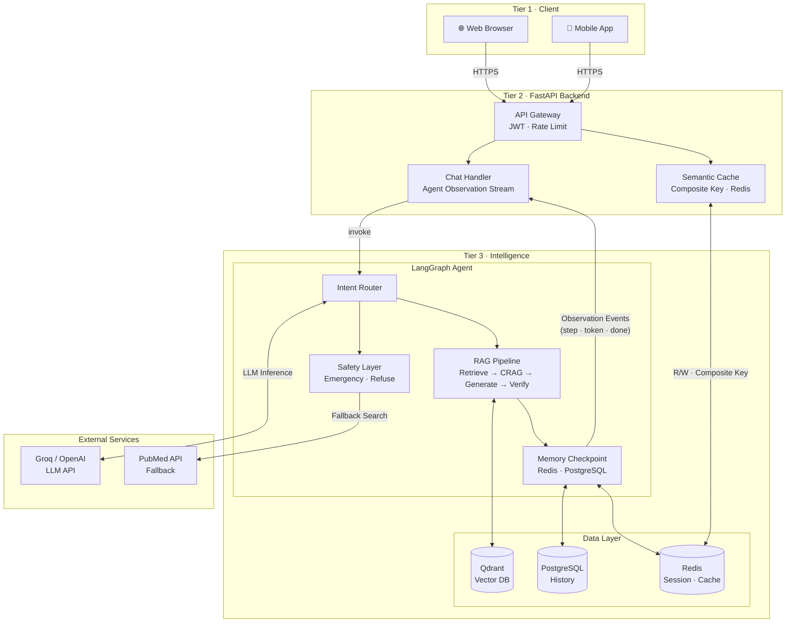
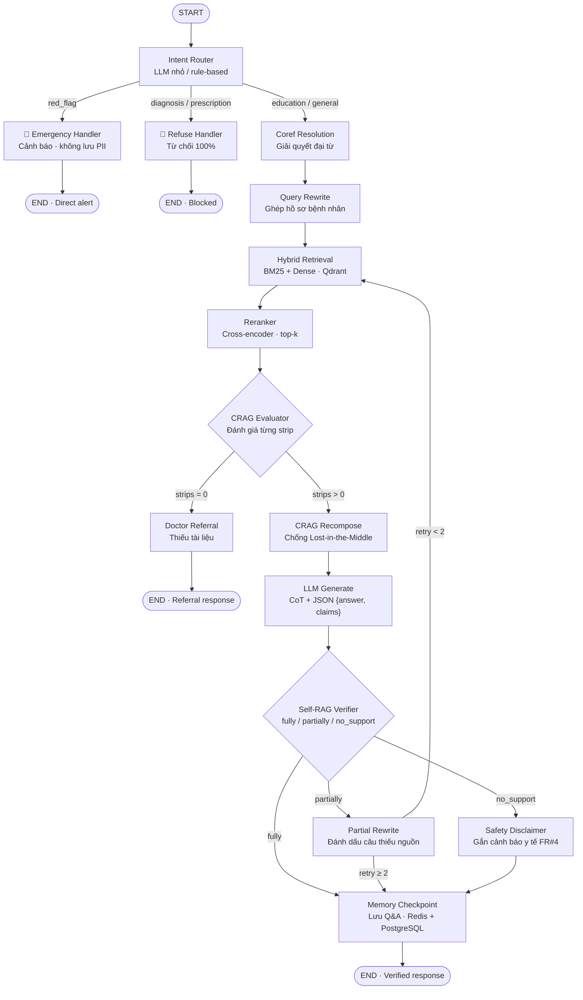
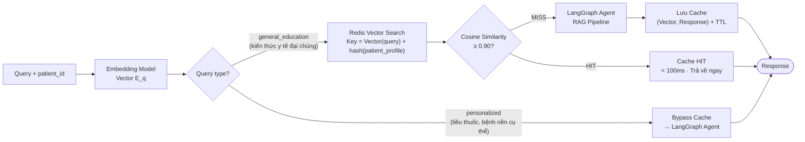
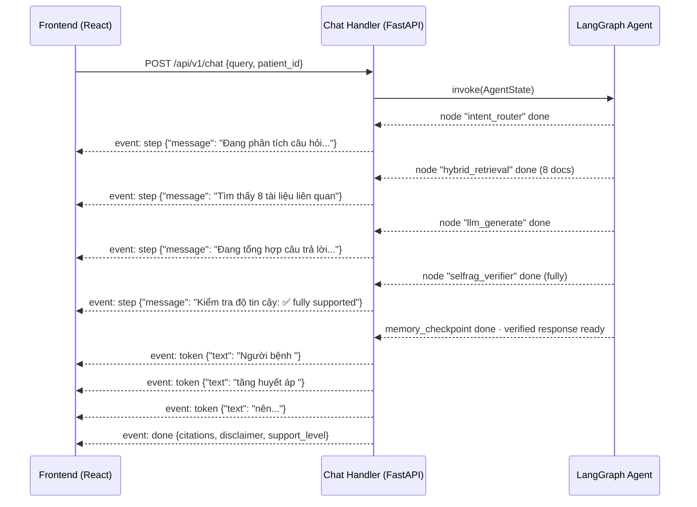
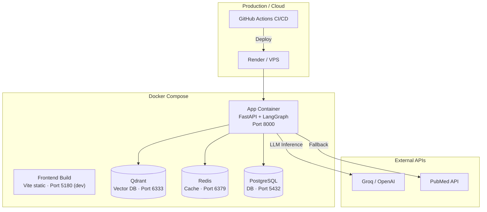

# Architecture Diagram — Medical AI Agent (P-128)

> Tài liệu này là bản tóm tắt sơ đồ trực quan cho `ARCHITECTURE.md`.
> Nguồn chân lý là `ARCHITECTURE.md` — khi có mâu thuẫn, `ARCHITECTURE.md` được ưu tiên.

---

## 1. Kiến trúc 3 Tầng (System Overview)

| Tầng | Trách nhiệm | Thành phần |
| :--- | :--- | :--- |
| **Tier 1** · Client | UI, nhận Agent Observation Stream | Web Browser · Mobile App |
| **Tier 2** · Backend | Auth, cache có ngữ cảnh, điều phối | API Gateway · Semantic Cache · Chat Handler |
| **Tier 3** · Intelligence | Xử lý AI + lưu trữ dữ liệu | LangGraph Agent · Qdrant · PostgreSQL · Redis |

---

## 2. LangGraph Agent Flow (Chi tiết)

---

## 3. Semantic Cache — Cơ chế Composite Key

> **Quy tắc an toàn y tế:** Query `personalized` (liên quan liều dùng, chỉ số cá nhân, tương tác thuốc) **luôn bypass cache** — tránh trả về kết quả của bệnh nhân khác với hồ sơ khác nhau.

---

## 4. Agent Observation Stream — Luồng SSE

> **Lưu ý thiết kế:** `token` events chỉ được phát **sau khi `selfrag_verifier` hoàn thành**. Không có token nào của câu trả lời chưa kiểm chứng xuất hiện trên FE.

---

## 5. Deployment Stack

| Container | Image | Port | Vai trò |
| :--- | :--- | :--- | :--- |
| `app` | `python:3.11` | `8000` | FastAPI + LangGraph Agent |
| `qdrant` | `qdrant/qdrant` | `6333` | Vector Database |
| `redis` | `redis:alpine` | `6379` | Session · Semantic Cache |
| `postgres` | `postgres:15` | `5432` | Chat History · User Data |

---

## 6. Tech Stack Summary

| Layer | Technology | Ghi chú |
| :--- | :--- | :--- |
| **Frontend** | Vite 8 + React 19 + TypeScript | SPA · Port 5180 dev |
| **Routing** | react-router-dom v7 | Client-side routing |
| **Server State** | @tanstack/react-query v5 | Fetch + cache + SSE |
| **Form** | react-hook-form + Zod | Type-safe validation |
| **Styling** | Tailwind CSS v4 | Utility-first |
| **API Mock** | msw | FE độc lập với backend |
| **Backend** | FastAPI + Uvicorn | Async · SSE native |
| **Agent** | LangGraph | State machine · 15 nodes |
| **LLM** | Groq (tốc độ) / OpenAI (chất lượng) | Hoán đổi linh hoạt |
| **Vector DB** | Qdrant | Hybrid BM25 + Dense |
| **Cache** | Redis · Semantic Cache | Composite key |
| **DB** | PostgreSQL 15 | Chat history |
| **DevOps** | Docker Compose + GitHub Actions | CI/CD sẵn |
| **Eval** | RAGAS + pytest | Faithfulness · Safety |
