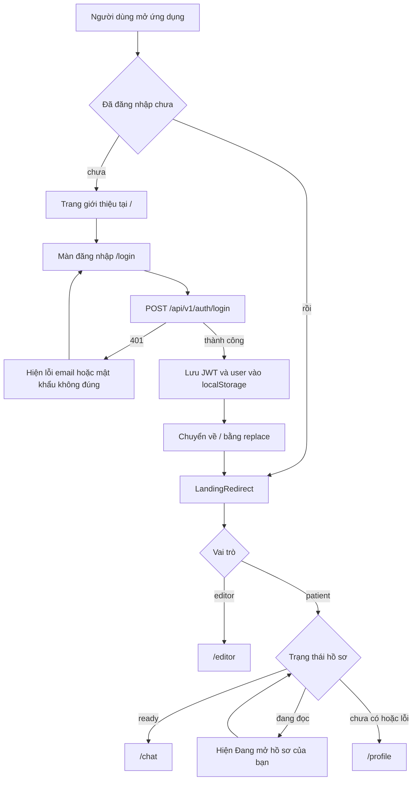
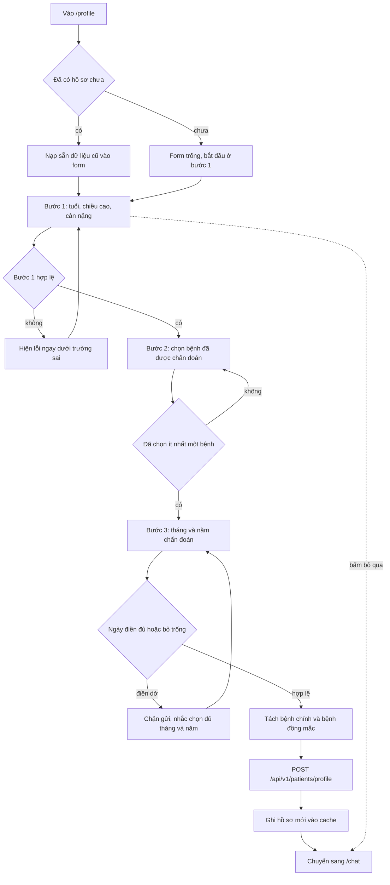
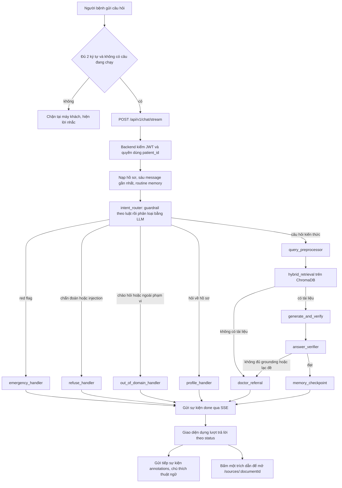
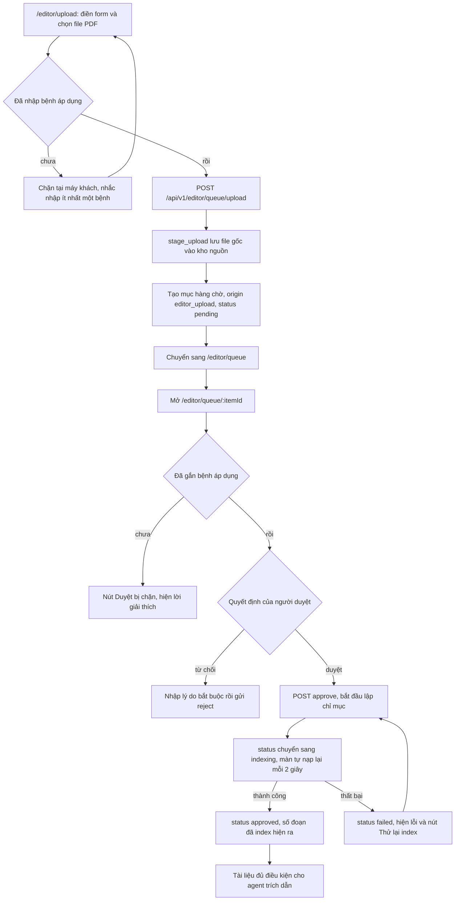
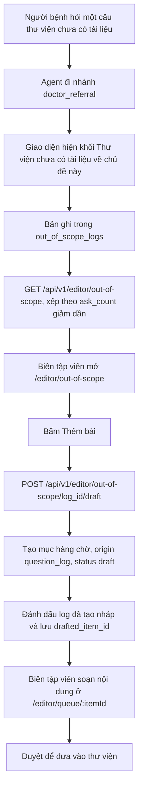

# Đặc tả chức năng — EduHealth AI

## 1. Giới thiệu

### 1.1. Mục đích tài liệu

Tài liệu này mô tả những gì hệ thống làm được, ai làm được việc gì, và mỗi màn
hình hoạt động ra sao. Nội dung được rút từ mã nguồn đang có trong repo, không
phải từ bản thiết kế dự kiến. Khi mã nguồn và tài liệu thiết kế cũ nói khác
nhau, tài liệu này lấy theo mã nguồn.

Nguồn đối chiếu chính:

- `frontend/src/App.tsx` — bảng route và guard của từng đường dẫn
- `frontend/src/app/guards.tsx` — bốn guard điều hướng
- `frontend/src/screens/` — 16 file màn hình
- `frontend/src/lib/api.ts` và `frontend/src/lib/schemas.ts` — hợp đồng dữ liệu
- `src/api/v1/` — các endpoint thật của backend
- `src/agent/` và `src/services/guardrail/` — luật an toàn của agent
- `docs/langgraph-v2.md`, `docs/gate1/prd.md`, `docs/gate1/brief.md`

### 1.2. Phạm vi

Tài liệu bao phủ:

- Hai vai trò người dùng và quyền của từng vai trò
- 17 đường dẫn màn hình trong ứng dụng web
- Năm luồng nghiệp vụ chính
- Các trạng thái trả lời của trợ lý và điều kiện kích hoạt
- Quy tắc nghiệp vụ và yêu cầu phi chức năng

Tài liệu không bao phủ: chi tiết cài đặt kỹ thuật của tầng RAG, cách chấm điểm
của bộ đánh giá trong `eval/`, và quy trình triển khai. Những phần đó nằm ở
`docs/langgraph-v2.md`, `eval/` và `README.md`.

### 1.3. Người đọc dự kiến

- Thành viên phát triển cần biết một màn hình phải làm gì trước khi sửa nó
- Người kiểm thử cần biết điều kiện vào màn, thao tác hợp lệ và kết quả mong đợi
- Người viết tài liệu và người chuẩn bị demo cần một bản mô tả sản phẩm đầy đủ
- Biên tập viên y khoa cần hiểu quy trình duyệt tài liệu mà mình tham gia

## 2. Vai trò người dùng

Hệ thống có đúng hai vai trò. Vai trò do backend quyết định từ tài khoản và
được đặt vào JWT lúc đăng nhập (`src/api/v1/auth.py`). Giao diện không có chỗ
nào cho người dùng tự chọn vai trò.

### 2.1. Bệnh nhân (`patient`)

Làm được:

- Khai và sửa hồ sơ bệnh của chính mình: tuổi, bệnh đã được chẩn đoán, thời
  điểm chẩn đoán, chiều cao, cân nặng
- Đặt câu hỏi sức khỏe bằng chữ hoặc bằng giọng nói, nhận câu trả lời kèm trích
  dẫn nguồn
- Nghe câu trả lời đọc thành tiếng
- Mở tài liệu nguồn để xem đúng đoạn được trích dẫn
- Mở lại các cuộc hội thoại đã lưu
- Đọc bài học trong lộ trình học tập và đánh dấu hoàn thành
- Làm bài trắc nghiệm và xem lại những câu đã trả lời sai

Không làm được:

- Vào bất kỳ màn nào trong khu vực `/editor`
- Xem hồ sơ, hội thoại hoặc dữ liệu học tập của tài khoản khác
- Xem tài liệu chưa được duyệt
- Nhận chẩn đoán, đơn thuốc hoặc chỉ định liều thuốc từ trợ lý

### 2.2. Biên tập viên (`editor`)

Làm được:

- Xem số liệu tổng hợp về hàng chờ duyệt và câu hỏi chưa trả lời được
- Tải tài liệu PDF mới vào hàng chờ, kèm siêu dữ liệu và bệnh áp dụng
- Xem danh sách tài liệu nguồn cùng trạng thái duyệt và trạng thái lập chỉ mục
- Mở toàn văn tài liệu gốc dạng PDF hoặc Markdown
- Sửa nội dung một mục trong hàng chờ trước khi duyệt
- Duyệt hoặc từ chối một mục, chạy lại bước lập chỉ mục khi lỗi
- Xem những câu hỏi thư viện chưa trả lời được và tạo bản nháp tài liệu từ đó

Không làm được:

- Vào các màn của bệnh nhân: `/profile`, `/chat`, `/sources`, `/learning`,
  `/quiz`
- Đọc nội dung hội thoại của bệnh nhân. Màn câu hỏi ngoài phạm vi chỉ hiện câu
  hỏi và số lượt hỏi, không hiện danh tính người hỏi
- Đưa tài liệu vào thư viện trích dẫn mà bỏ qua bước lập chỉ mục

## 3. Quy tắc phân quyền

### 3.1. Bảng đối chiếu đường dẫn và vai trò

| Đường dẫn | Vai trò được vào | Guard áp dụng |
| :-- | :-- | :-- |
| `/` | công khai và mọi vai trò | `RootRoute`, khi đã đăng nhập thì chuyển sang `LandingRedirect` |
| `/login` | chỉ người chưa đăng nhập | `RedirectIfAuthenticated` |
| `/profile` | patient | `RequireAuth` rồi `RequireRole role="patient"` |
| `/chat` | patient | `RequireAuth` rồi `RequireRole role="patient"` |
| `/chat/:conversationId` | patient | `RequireAuth` rồi `RequireRole role="patient"` |
| `/sources/:documentId` | patient | `RequireAuth` rồi `RequireRole role="patient"` |
| `/learning` | patient | `RequireAuth` rồi `RequireRole role="patient"` |
| `/learning/:articleId` | patient | `RequireAuth` rồi `RequireRole role="patient"` |
| `/quiz` | patient | `RequireAuth` rồi `RequireRole role="patient"` |
| `/quiz/mistakes` | patient | `RequireAuth` rồi `RequireRole role="patient"` |
| `/editor` | editor | `RequireAuth` rồi `RequireRole role="editor"` |
| `/editor/upload` | editor | `RequireAuth` rồi `RequireRole role="editor"` |
| `/editor/documents` | editor | `RequireAuth` rồi `RequireRole role="editor"` |
| `/editor/documents/:documentId` | editor | `RequireAuth` rồi `RequireRole role="editor"` |
| `/editor/queue` | editor | `RequireAuth` rồi `RequireRole role="editor"` |
| `/editor/queue/:itemId` | editor | `RequireAuth` rồi `RequireRole role="editor"` |
| `/editor/out-of-scope` | editor | `RequireAuth` rồi `RequireRole role="editor"` |
| đường dẫn lạ | mọi vai trò đã đăng nhập | nằm trong `RequireAuth`, chuyển về `/` |

Toàn bộ đường dẫn trừ `/` và `/login` nằm trong một route layout đã bọc
`RequireAuth`, nên luật "chưa đăng nhập thì về `/login`" được đặt ở đúng một
chỗ và áp dụng cho cả đường dẫn lạ.

### 3.2. Mô tả từng guard

`RequireAuth` — đọc `isAuthenticated` từ phiên. Chưa đăng nhập thì chuyển về
`/login` bằng `replace`, tức không để lại vết trong lịch sử trình duyệt.

`RequireRole` — nhận một vai trò yêu cầu. Không có `user` thì chuyển về
`/login`. Có `user` nhưng sai vai trò thì chuyển về `HOME_PATH`, tức "nhà" của
chính vai trò đang đăng nhập, chứ không đẩy về màn đăng nhập. Lý do ghi trong
mã nguồn: người dùng không làm gì sai và cũng không cần đăng nhập lại, họ chỉ
gõ nhầm một đường dẫn không thuộc về mình.

`RedirectIfAuthenticated` — bọc riêng `/login`. Đã đăng nhập rồi thì vào thẳng
nhà của vai trò, không bắt đăng nhập lại.

`LandingRedirect` — chạy ở đường dẫn gốc khi đã đăng nhập. Thứ tự rẽ:

1. Không có `user` thì về `/login`
2. Vai trò `editor` thì về `/editor`
3. Vai trò `patient` thì phải chờ đọc xong hồ sơ mới rẽ. Trong lúc chờ, màn
   hiện dòng "Đang mở hồ sơ của bạn" trên nền navy
4. Hồ sơ ở trạng thái `ready` thì về `/chat`, còn lại thì về `/profile`

Mã nguồn ghi rõ vì sao phải chờ: rẽ sớm sang `/profile` rồi lát nữa hồ sơ về
lại đá ngược sang `/chat` sẽ cho người dùng thấy màn nhấp nháy qua hai trang.
Khi đọc hồ sơ hỏng thì đưa về `/profile`, vì ở đó có khối lỗi kèm nút thử lại.

Ghi chú về ranh giới trách nhiệm: guard ở tầng điều hướng chỉ giữ cho giao diện
không dẫn người dùng vào chỗ không phải của họ. Chặn thật nằm ở backend. Mọi
endpoint trừ `/health`, `/status`, `/auth/login` và `/auth/logout` đều yêu cầu
JWT hợp lệ; nhóm `/editor` còn qua thêm `get_editor_user`, trả 403 nếu vai trò
không phải `editor`.

### 3.3. Xử lý khi phiên hết hạn

Token do backend cấp có hạn 7 ngày (`ACCESS_TOKEN_EXPIRE_MINUTES` trong
`src/api/v1/auth.py`). Hệ thống không có refresh token.

Khi một request nhận về 401:

1. Lớp API trong `frontend/src/lib/api.ts` gọi handler đã đăng ký
2. `ExpiredSessionWatcher` xoá phiên khỏi `localStorage` và gỡ token khỏi lớp API
3. Cache của TanStack Query bị dọn sạch, để dữ liệu của người vừa bị đăng xuất
   không nhấp nháy trước mắt người đăng nhập tiếp theo trên cùng máy
4. Người dùng được đưa về `/login` kèm lý do `session-expired` trong
   `location.state`
5. Màn đăng nhập đọc lý do đó và hiện dòng "Phiên đăng nhập của bạn đã hết hạn.
   Bạn hãy đăng nhập lại để tiếp tục"

Endpoint đăng nhập được đánh dấu `skipUnauthorizedHandler`, nên 401 ở đó không
kích hoạt luồng trên mà hiện thành thông báo sai email hoặc mật khẩu ngay trên
form.

Khi tải lại trang, phiên được đọc lại từ `localStorage` và trường `user` được
parse qua `userInfoSchema` chứ không tin thẳng, để không sửa được `role` bằng
công cụ nhà phát triển của trình duyệt.

## 4. Đặc tả từng màn hình

17 đường dẫn, dùng 16 file màn hình. `/chat` và `/chat/:conversationId` dùng
chung `ChatScreen.tsx`.

### 4.1. Trang giới thiệu — `/`

Mục đích: trả lời ba câu cho người mở ứng dụng lần đầu, trước khi họ bấm đăng
nhập: đây là cái gì, dựa trên nguồn nào, và nó không làm gì.

Điều kiện vào màn: chưa đăng nhập. Đã đăng nhập thì `RootRoute` chuyển sang
`LandingRedirect` và người dùng không bao giờ thấy màn này.

Dữ liệu hiển thị: toàn bộ là nội dung tĩnh khai trong chính file màn hình. Màn
không gọi endpoint nào. Gồm phần dẫn, ba thẻ giá trị, mục "Dùng thế nào" gồm ba
bước có thứ tự, mục "Thư viện đến từ đâu", mục câu hỏi thường gặp và chân trang.

Thao tác người dùng làm được:

- Bấm "Bắt đầu học ngay" để sang `/login`
- Bấm ba mục điều hướng để nhảy tới neo trong trang: cách hoạt động, nguồn tài
  liệu, câu hỏi thường gặp
- Đổi chế độ sáng tối

Trạng thái đặc biệt: không có. Màn tĩnh nên không có trạng thái đang tải, rỗng
hay lỗi.

Kết quả và điều hướng: mọi nút dẫn tới `/login`.

### 4.2. Đăng nhập — `/login`

Mục đích: xác thực tài khoản và nhận JWT cùng thông tin vai trò.

Điều kiện vào màn: chưa đăng nhập. `RedirectIfAuthenticated` đẩy người đã đăng
nhập về nhà của vai trò họ.

Dữ liệu hiển thị: form hai trường email và mật khẩu. Không có endpoint nào được
gọi lúc mở màn. Khi chạy ở chế độ phát triển, màn hiện thêm khối tài khoản mẫu
đọc từ `frontend/src/mocks/demoAccounts.ts`; khối này bọc trong
`import.meta.env.DEV` nên bị loại khỏi bản phát hành.

Thao tác người dùng làm được:

- Nhập email và mật khẩu rồi bấm Đăng nhập, gọi `POST /api/v1/auth/login`
- Bấm một tài khoản mẫu để tự điền vào form, chỉ khi chạy chế độ phát triển
- Bấm tên ứng dụng ở góc để về `/`

Kiểm tra dữ liệu tại máy khách, dựng từ `loginRequestSchema`:

- Email phải đúng dạng, thông báo lỗi "Bạn hãy nhập đúng dạng email, ví dụ
  ten@example.com."
- Mật khẩu không được rỗng, thông báo lỗi "Bạn hãy nhập mật khẩu."
- Lỗi hiện ngay dưới trường của nó, không gom về cuối form

Trạng thái đặc biệt:

- Đang tải: nút đổi chữ thành "Đang đăng nhập…" và bị vô hiệu, kèm dòng
  "Đang kiểm tra tài khoản…"
- Rỗng: không áp dụng
- Lỗi 401: khối cảnh báo với tiêu đề "Email hoặc mật khẩu không đúng". Hệ thống
  cố ý không phân biệt "email không tồn tại" với "mật khẩu sai", để người ngoài
  không dò được một địa chỉ có tài khoản trong hệ thống hay không
- Lỗi khác: khối `ErrorNotice` kèm nút "Đăng nhập lại"
- Phiên hết hạn: dòng thông báo riêng ở đầu form, xem mục 3.3

Kết quả và điều hướng: đăng nhập thành công thì lưu phiên rồi chuyển về `/`
bằng `replace`. Màn đăng nhập cố ý không tự đoán đích; `LandingRedirect` mới đủ
dữ kiện để rẽ theo vai trò và theo hồ sơ.

### 4.3. Hồ sơ bệnh nhân — `/profile`

Mục đích: thu thập những thông tin agent cần để cá nhân hoá câu trả lời.

Điều kiện vào màn: đã đăng nhập, vai trò `patient`. Người mới đăng nhập mà chưa
có hồ sơ sẽ được `LandingRedirect` đưa thẳng vào đây.

Dữ liệu hiển thị: hồ sơ hiện có, đọc qua `PatientProvider` từ
`GET /api/v1/patients/{patient_id}/profile`. Khi đang ở chế độ sửa hồ sơ, màn
hiện thêm hai ô số liệu học tập lấy từ `GET /api/v1/learning/daily-lesson`.

Form chia ba bước, có thanh tiến trình:

| Bước | Tiêu đề | Trường |
| :-- | :-- | :-- |
| 1 | Tuổi và thể trạng | `age` bắt buộc, `height_cm` và `weight_kg` không bắt buộc |
| 2 | Bệnh đã được chẩn đoán | `conditions`, chọn ít nhất một |
| 3 | Thời điểm chẩn đoán | `diagnosed_at`, không bắt buộc |

Ràng buộc giá trị, đặt trong `ProfileScreen.tsx` và đối chiếu tự động với
`patientProfileSchema` bằng hàm `assertMatchesContract` chạy lúc nạp module:

- `age`: số nguyên từ 18 đến 120
- `height_cm`: số nguyên từ 100 đến 250, hoặc bỏ trống
- `weight_kg`: từ 25 đến 300, cho phép số lẻ, hoặc bỏ trống
- `diagnosed_at`: dạng `YYYY-MM`, không được ở tương lai, hoặc bỏ trống
- `conditions`: chọn trong hai giá trị `type2_diabetes` và `hypertension`,
  chọn được cả hai

Bệnh được chọn sẽ tách thành `primary_condition` và `comorbidities` trước khi
gửi đi. Nếu hồ sơ cũ đã có bệnh chính và bệnh đó vẫn nằm trong danh sách vừa
chọn thì bệnh chính giữ nguyên, còn lại lấy bệnh đầu tiên theo thứ tự khai báo.

Trường `asking_as` luôn được gửi giá trị `self`; màn hình không có ô nào cho
người dùng đổi giá trị này, dù schema cho phép thêm giá trị `caregiver`.

Thao tác người dùng làm được:

- Điền từng bước, bấm tiếp để sang bước sau. Mỗi lần bấm tiếp chỉ kiểm tra các
  trường của bước hiện tại
- Quay lại bước trước
- Bấm lưu ở bước cuối, gọi `POST /api/v1/patients/profile`
- Bấm "Bỏ qua, tôi muốn thử hỏi một câu trước" để sang thẳng `/chat`

Trạng thái đặc biệt:

- Đang tải: dòng "Đang mở hồ sơ của bạn…"
- Rỗng: hồ sơ chưa có thì form mở ở trạng thái trống, đây là luồng bình thường
  của người mới, không phải trạng thái lỗi
- Lỗi: khối `ErrorNotice` kèm nút thử lại đọc hồ sơ
- Ngày chẩn đoán điền dở, tức có tháng mà thiếu năm hoặc ngược lại, thì hiện
  "Hãy chọn đủ tháng và nhập đủ 4 chữ số của năm" và chặn gửi

Kết quả và điều hướng: lưu thành công thì ghi hồ sơ mới vào cache của query rồi
chuyển sang `/chat` bằng `replace`.

### 4.4. Hỏi đáp — `/chat`

Mục đích: chỗ bệnh nhân đặt câu hỏi và nhận câu trả lời có trích dẫn.

Điều kiện vào màn: đã đăng nhập, vai trò `patient`. Không bắt buộc phải có hồ
sơ; thiếu hồ sơ thì màn vẫn dùng được và hiện một dải nhắc khai hồ sơ.

Dữ liệu hiển thị và endpoint:

| Phần | Endpoint |
| :-- | :-- |
| Câu trả lời cho câu hỏi vừa gửi | `POST /api/v1/chat/stream`, kiểu SSE |
| Câu trả lời khi hỏi bằng giọng nói | `POST /api/v1/voice/chat/stream`, kiểu SSE |
| Đọc câu trả lời thành tiếng | `POST /api/v1/voice/speech`, trả về MP3 |
| Banner bài học hàng ngày | `GET /api/v1/learning/daily-lesson` |
| Chấm câu hỏi của bài học hàng ngày | `POST /api/v1/learning/complete-lesson/{article_id}` |

Thanh bên liệt kê các phiên hội thoại bằng `GET /api/v1/conversations/{patient_id}`.
Phần này thuộc khung `RootLayout`, dựng trong `frontend/src/ui/ConversationNav.tsx`,
không thuộc màn hỏi đáp.

Luồng sự kiện SSE gồm năm loại: `step` báo agent đang chạy tới node nào, `token`
mang từng khối chữ của câu trả lời, `done` mang kết quả đầy đủ, `annotations`
mang chú thích thuật ngữ, và `error`.

Mỗi node của agent có một câu mô tả riêng hiện trong lúc chờ, ví dụ
`hybrid_retrieval` hiện "Tôi đang tìm tài liệu phù hợp." kèm dòng phụ "Tôi sẽ
chỉ dùng thông tin có nguồn để trả lời bạn."

Thao tác người dùng làm được:

- Gõ câu hỏi rồi gửi
- Bấm một câu hỏi gợi ý khi màn còn trống
- Mở chế độ hỏi bằng giọng nói, ghi âm và gửi
- Bấm nghe một câu trả lời đã có
- Bấm vào một trích dẫn để sang màn tài liệu nguồn
- Làm câu hỏi của bài học hàng ngày ngay trên banner
- Làm bài trắc nghiệm về nội dung vừa trao đổi, khi trạng thái câu trả lời cuối
  là `answered` hoặc `partial`

Kiểm tra trước khi gửi:

- Câu hỏi gõ tay phải dài ít nhất `MIN_QUERY_LENGTH` là 2 ký tự sau khi cắt
  khoảng trắng. Câu ngắn hơn bị chặn ngay tại máy khách với thông báo "Câu hỏi
  cần ít nhất 2 ký tự để trợ lý hiểu bạn."
- Đang có một câu hỏi chạy dở thì câu tiếp theo bị chặn với thông báo "Trợ lý
  đang xử lý câu hỏi trước. Bạn hãy chờ một chút rồi thử lại."
- Câu hỏi gửi bằng giọng nói không qua kiểm tra độ dài, vì lúc gửi chưa có chữ

Trạng thái đặc biệt:

- Đang tải: khối chờ hiện câu mô tả theo node hiện tại; khi đã có chữ thì hiện
  câu trả lời đang chạy kèm con trỏ nhấp nháy
- Rỗng: chưa có lượt nào thì hiện danh sách câu hỏi gợi ý, dựng theo hồ sơ
- Lỗi: khối `ErrorNotice` kèm nút "Gửi lại câu hỏi", giữ nguyên câu hỏi vừa gõ
- Thiếu hồ sơ: dải nền sand kèm nút "Khai hồ sơ"
- Sau một câu trả lời trạng thái `red_flag`: ô nhập bị gỡ khỏi màn, thay bằng
  dòng "Việc cần làm bây giờ là đi khám. Khi nào bạn đã ổn và muốn hỏi tiếp,
  bạn hãy bấm Câu hỏi mới."

Kết quả và điều hướng: nhận `done` thì lượt hỏi đáp được thêm vào màn,
`conversation_id` được ghi lại để câu sau nối vào cùng phiên, và danh sách hội
thoại ở thanh bên được nạp lại. Màn không tự chuyển đường dẫn.

### 4.5. Hỏi đáp, phiên đã lưu — `/chat/:conversationId`

Mục đích: mở lại một cuộc hội thoại cũ và hỏi tiếp trong cùng phiên đó.

Điều kiện vào màn: đã đăng nhập, vai trò `patient`, và có `conversationId` trên
đường dẫn. Thường được mở từ danh sách hội thoại ở thanh bên.

Dữ liệu hiển thị: lịch sử của phiên, đọc từ
`GET /api/v1/conversations/{patient_id}/{conversation_id}`. Danh sách message
được gộp thành từng lượt hỏi đáp: message vai trò `user` thành câu hỏi, message
kế tiếp thành câu trả lời kèm trích dẫn và chú thích. Mọi thứ còn lại giống
`/chat`.

Thao tác người dùng làm được: giống `/chat`, cộng thêm việc hỏi tiếp vào đúng
phiên đang mở.

Trạng thái đặc biệt:

- Đang tải: dòng "Đang mở lại hội thoại đã lưu…"
- Lỗi: khối `ErrorNotice` kèm nút "Mở lại hội thoại"

Kết quả và điều hướng: bấm "Câu hỏi mới" sẽ đưa về `/chat` và dựng lại màn từ
đầu. Màn được khoá theo `conversationId` khi mở phiên cũ, và theo `location.key`
khi ở `/chat`, để mỗi lần bấm "Câu hỏi mới" đều cho một màn sạch kể cả khi
đường dẫn không đổi.

### 4.6. Tài liệu nguồn — `/sources/:documentId`

Mục đích: chứng minh câu trả lời lấy từ đâu, bằng cách mở đúng đoạn được trích
trong tài liệu gốc.

Điều kiện vào màn: đã đăng nhập, vai trò `patient`. Đường dẫn phải có cả
`documentId` và tham số truy vấn `chunk`. Thiếu một trong hai thì màn không gọi
API.

Dữ liệu hiển thị: `GET /api/v1/sources/documents/{document_id}?chunk_id=...`.
Response gồm tiêu đề, cơ quan ban hành, năm ban hành, số hiệu văn bản, tổng số
đoạn của tài liệu, đoạn được trích và các đoạn xung quanh. Backend chỉ trả đoạn
được trích cộng hai đoạn trước và hai đoạn sau.

Nội dung mỗi đoạn được dựng theo ba cách, xét lần lượt: nếu đoạn có bảng có cấu
trúc thì dựng thành bảng, nếu nội dung là bảng dạng markdown gạch đứng thì phân
tích rồi dựng thành bảng, còn lại thì hiện thành đoạn văn giữ nguyên xuống dòng.

Thao tác người dùng làm được:

- Đọc tài liệu, đoạn được trích có nền riêng và nhãn "Đoạn đã trích"
- Bấm "Về câu trả lời" để lùi một bước trong lịch sử trình duyệt

Trạng thái đặc biệt:

- Đang tải: dòng "Đang mở tài liệu nguồn…"
- Thiếu tham số: khối `EmptyState` với tiêu đề "Liên kết tài liệu chưa đầy đủ"
  và nút về hỏi đáp
- Lỗi: khối `ErrorNotice` kèm nút "Tải lại tài liệu"

Kết quả và điều hướng: khi tải xong, màn tự cuộn tới đoạn được trích và đặt nó
vào giữa khung nhìn.

### 4.7. Thư viện bài học — `/learning`

Mục đích: bày toàn bộ lộ trình học theo chặng và cho biết đang học tới đâu.

Điều kiện vào màn: đã đăng nhập, vai trò `patient`.

Dữ liệu hiển thị: `GET /api/v1/learning/library`, trả về `learning_paths` và
`completed_articles`. Màn tính chặng kế tiếp là chặng đầu tiên chưa nằm trong
danh sách đã hoàn thành. Mỗi thẻ chặng có một trong ba trạng thái: đã xong, học
tiếp, chưa tới.

Nguồn của dữ liệu này: bảng `articles` và `learning_paths` được nạp bằng
`scripts/init_db.py`, hoặc bằng `POST /api/v1/editor/seed-database` gọi lại chính
script đó. Khu vực biên tập không có endpoint nào tạo hay sửa bài học.

Thao tác người dùng làm được:

- Bấm một chặng để mở `/learning/:articleId`
- Bấm "Đọc bài này" ở khối bài học hôm nay
- Bấm "Làm bài trắc nghiệm" để sang `/chat`, nơi có banner chấm điểm

Trạng thái đặc biệt:

- Đang tải: dòng "Đang tải lộ trình học tập…"
- Rỗng: khối `EmptyState` với tiêu đề "Chưa có chặng nào trong lộ trình". Nội
  dung cố ý chỉ mô tả điều màn này biết chắc là danh sách trả về không có mục
  nào, không suy diễn thêm
- Lỗi: khối `ErrorNotice` kèm nút "Tải lại lộ trình"

Kết quả và điều hướng: mọi thao tác đều dẫn sang `/learning/:articleId` hoặc
`/chat`.

### 4.8. Chi tiết bài học — `/learning/:articleId`

Mục đích: đọc trọn một bài học và tự kiểm tra nhanh ngay sau khi đọc.

Điều kiện vào màn: đã đăng nhập, vai trò `patient`, và `articleId` phải khớp
một mục trong lộ trình.

Dữ liệu hiển thị: màn dùng lại `GET /api/v1/learning/library` rồi tìm bài theo
id, chứ không có endpoint riêng cho một bài. Nội dung bài hiện bằng markdown,
lấy `full_content` nếu có, không thì lấy `content`. Khối nguồn tài liệu hiện
khi `origin_source` khớp một trong hai tên file đã khai sẵn trong màn:
`vn-moh-5481-2020-t2dm.pdf` và `vn-moh-3192-2010-htn.pdf`.

Thao tác người dùng làm được:

- Đọc bài
- Làm khối "Ôn tập nhanh" gồm 2 câu, sinh qua `POST /api/v1/quiz` với
  `source=article`
- Bấm liên kết sang `/quiz?source=article&ref=<id>` để làm bài đầy đủ 5 câu
- Bấm "Về lộ trình học tập" để lùi một bước lịch sử

Trạng thái đặc biệt:

- Đang tải: dòng "Đang mở bài học…"
- Không tìm thấy bài: khối `EmptyState` "Không tìm thấy bài học này" kèm nút về
  lộ trình
- Lỗi: khối `ErrorNotice` kèm nút "Tải lại"

Kết quả và điều hướng: bài đã hoàn thành thì hiện nhãn "Đã hoàn thành". Bài
chưa hoàn thành mà có câu hỏi cộng điểm thì cuối màn có dòng nhắc rằng chỗ chấm
10 điểm nằm ở banner "Bài học hôm nay" trên màn hỏi đáp, mỗi ngày một lần. Màn
cố ý không in câu hỏi đó ra để không lộ đáp án của chỗ đang chấm điểm.

### 4.9. Trắc nghiệm — `/quiz`

Mục đích: chặng tự kiểm tra của vòng học, sau khi đọc bài và hỏi trợ lý.

Điều kiện vào màn: đã đăng nhập, vai trò `patient`.

Dữ liệu hiển thị: nguồn ra đề đọc từ tham số truy vấn. `source=article` cùng
`ref` thì ra đề từ một bài học; `source=conversation` cùng `ref` thì ra đề từ
một cuộc hội thoại; thiếu `ref` hoặc giá trị khác thì mặc định về `profile`,
tức ra đề từ những bài đã học và những điều đã hỏi.

Đề sinh qua `POST /api/v1/quiz`, mặc định 5 câu. Số câu hợp lệ theo
`quizRequestSchema` là từ 2 đến 10. Nộp bài qua
`POST /api/v1/quiz/{quiz_id}/submit`.

Thao tác người dùng làm được:

- Bấm "Bắt đầu làm bài" để sinh đề
- Chọn đáp án cho từng câu
- Nộp bài và xem điểm cùng lời giải thích từng câu
- Làm lại một đề mới
- Bấm sang `/quiz/mistakes` hoặc về `/learning`

Trạng thái đặc biệt:

- Đang tải: nút sinh đề chuyển sang trạng thái đang chạy
- Rỗng: trước khi bấm bắt đầu, màn chỉ có nút và một dòng gợi ý theo nguồn ra đề
- Lỗi: khối `ErrorNotice` trong `QuizPanel`
- Nộp bài khi còn câu chưa chọn: màn đánh dấu các câu còn thiếu và không gửi

Kết quả và điều hướng: sau khi nộp, `QuizPanel` chuyển sang bảng kết quả. Màn
không tự chuyển đường dẫn.

### 4.10. Câu đã trả lời sai — `/quiz/mistakes`

Mục đích: gom những chỗ người học chưa nắm và cho làm lại bằng câu hỏi mới.

Điều kiện vào màn: đã đăng nhập, vai trò `patient`.

Dữ liệu hiển thị: `GET /api/v1/quiz/mistakes`, trả về danh sách câu sai kèm
`times_wrong`, tổng số lần sai và số bài đã quét. Câu sai nhiều lần xếp trước.
Mỗi thẻ hiện câu hỏi, các phương án, đáp án đúng và phương án người học đã chọn.

Thao tác người dùng làm được:

- Đọc lại từng chỗ sai
- Bấm "Làm lại bằng câu hỏi mới" để mở `QuizPanel` với `source=mistakes`. Đề
  mới hỏi về đúng các khái niệm cũ nhưng diễn đạt khác đi
- Bấm về `/quiz`

Trạng thái đặc biệt:

- Đang tải: dòng "Đang xem lại bài làm của bạn…"
- Rỗng: dòng "Bạn chưa trả lời sai câu nào. Làm thêm vài bài trắc nghiệm rồi
  quay lại đây nhé." kèm nút sang `/quiz`
- Lỗi: khối `ErrorNotice` kèm nút "Tải lại"

Kết quả và điều hướng: bấm làm lại thì khối trắc nghiệm hiện ngay trong màn,
không chuyển đường dẫn.

### 4.11. Bảng tổng quan biên tập viên — `/editor`

Mục đích: hai con số nói ngay còn bao nhiêu việc phải làm.

Điều kiện vào màn: đã đăng nhập, vai trò `editor`. Đây là đích của
`LandingRedirect` với vai trò này.

Dữ liệu hiển thị: `GET /api/v1/editor/dashboard`, trả về `pending_count` và
`out_of_scope_count`.

Thao tác người dùng làm được:

- Bấm ô "Mục chờ duyệt" để sang `/editor/queue`
- Bấm ô "Câu hỏi chưa trả lời được" để sang `/editor/out-of-scope`
- Bấm "Tải lên tài liệu" để sang `/editor/upload`

Trạng thái đặc biệt:

- Đang tải: dòng "Đang đọc số liệu…"
- Rỗng: không có trạng thái rỗng riêng; hai ô vẫn hiện với giá trị 0
- Lỗi: khối `ErrorNotice` kèm nút "Đọc lại số liệu"

Kết quả và điều hướng: mọi ô đều là liên kết sang màn tương ứng.

### 4.12. Tải tài liệu lên — `/editor/upload`

Mục đích: đưa một tài liệu PDF mới vào hàng chờ duyệt.

Điều kiện vào màn: đã đăng nhập, vai trò `editor`.

Dữ liệu hiển thị: form trống. Màn không gọi endpoint nào lúc mở.

Các trường của form:

| Trường | Bắt buộc | Ghi chú |
| :-- | :-- | :-- |
| `file` | có | chỉ nhận `application/pdf` |
| `title` | có | tiêu đề tài liệu |
| `issuer` | có | nơi ban hành |
| `published` | có | năm hoặc ngày ban hành |
| `diseases` | có | danh sách bệnh, cách nhau bằng dấu phẩy |
| `doc_code` | không | số hiệu văn bản |
| `url` | không | đường dẫn tới bản gốc |
| `notes` | không | ghi chú cho người duyệt |

Thao tác người dùng làm được:

- Điền form rồi bấm "Tải lên tài liệu", gọi `POST /api/v1/editor/queue/upload`
  với `FormData`
- Bấm "Huỷ"

Trạng thái đặc biệt:

- Đang tải: nút đổi chữ thành "Đang tải lên…" và bị vô hiệu
- Rỗng: không áp dụng
- Lỗi: dòng cảnh báo nền sand ngay dưới tiêu đề. Thiếu trường `diseases` thì
  chặn ngay tại máy khách với thông báo "Bạn hãy nhập ít nhất một loại bệnh, ví
  dụ hypertension hoặc type2_diabetes."

Kết quả và điều hướng: tải lên thành công thì chuyển sang `/editor/queue`.
Backend lưu file vào kho nguồn qua `stage_upload` rồi tạo một mục hàng chờ ở
trạng thái `pending`, dùng chính `doc_id` của tài liệu làm id của mục. Bước
này không tự chạy lập chỉ mục và không sinh dữ liệu phụ nào khác.

Nút "Huỷ" điều hướng tới `/editor/dashboard`. Đường dẫn đó không có trong bảng
route, nên nó rơi vào nhánh chung rồi qua `LandingRedirect` quay về `/editor`.

### 4.13. Danh sách tài liệu nguồn — `/editor/documents`

Mục đích: cho biết tài liệu nào đang thật sự dùng được để trả lời.

Điều kiện vào màn: đã đăng nhập, vai trò `editor`.

Dữ liệu hiển thị: `GET /api/v1/editor/documents`. Mỗi tài liệu có hai trạng
thái riêng biệt, và chỉ tài liệu có đủ cả hai mới được agent dùng.

Trạng thái duyệt: `approved`, `pending_review`, `indexing`, `index_failed`,
`draft`, `quarantined`.

Trạng thái lập chỉ mục: `indexed`, `indexing`, `failed`, `not_indexed`,
`not_applicable`, `unavailable`.

Màn cũng hiện ba ô đếm: đang dùng được, cần xử lý, đã tải lên. Mỗi thẻ tài liệu
hiện thêm cơ quan ban hành, ngày ban hành, số hiệu, bệnh áp dụng, thời điểm tải
lên, thời điểm đổi trạng thái, số lần chạy lập chỉ mục và lỗi lập chỉ mục nếu có.

Thao tác người dùng làm được:

- Lọc theo bốn nhóm: tất cả, đang dùng được, cần xử lý, đã tải lên
- Bấm "Mở nguồn gốc" để mở đường dẫn nhà phát hành ở tab mới, khi tài liệu có
  trường `url`
- Bấm "Xem toàn văn" để sang `/editor/documents/:documentId`, chỉ hiện khi file
  gốc có trên máy chủ và định dạng có màn xem

Trạng thái đặc biệt:

- Đang tải: dòng "Đang đọc thư viện nguồn…"
- Rỗng: khối `EmptyState` "Không có tài liệu ở bộ lọc này"
- Lỗi: khối `ErrorNotice` kèm nút "Đọc lại thư viện"

Kết quả và điều hướng: chỉ dẫn sang màn xem toàn văn hoặc mở tab mới.

### 4.14. Xem file tài liệu — `/editor/documents/:documentId`

Mục đích: mở bản gốc để đối chiếu trước khi duyệt.

Điều kiện vào màn: đã đăng nhập, vai trò `editor`, và `documentId` phải khớp
một tài liệu trong danh sách nguồn.

Dữ liệu hiển thị: siêu dữ liệu lấy từ `GET /api/v1/editor/documents` rồi tìm
theo id; nội dung file lấy từ
`GET /api/v1/editor/documents/{document_id}/file`. File PDF được dựng qua object
URL, file Markdown được đọc thành chữ rồi hiện bằng `react-markdown` có
`remark-gfm`.

Thao tác người dùng làm được:

- Đọc toàn văn
- Bấm "Về thư viện tài liệu"
- Mở đường dẫn nhà phát hành, khi tài liệu có `url`

Trạng thái đặc biệt:

- Đang tải: dòng "Đang kiểm tra tài liệu nguồn…" khi đang đọc danh sách, và một
  trạng thái riêng khi đang tải file
- Không tìm thấy: khối `EmptyState` "Không tìm thấy tài liệu này"
- Không mở được toàn văn: khối nền sand "Chưa thể mở toàn văn tại đây", nói rõ
  là do file gốc không có trên máy chủ, hay do định dạng chưa có màn xem. Màn
  cố ý không hiện nội dung thay thế hay dữ liệu mẫu
- Lỗi: khối `ErrorNotice` kèm nút "Đọc lại thư viện"

Kết quả và điều hướng: không thay đổi dữ liệu, chỉ đọc.

### 4.15. Hàng chờ duyệt — `/editor/queue`

Mục đích: danh sách việc cần xử lý của khu vực biên tập.

Điều kiện vào màn: đã đăng nhập, vai trò `editor`.

Dữ liệu hiển thị: `GET /api/v1/editor/queue?status=...`. Màn gọi nhiều lần theo
các trạng thái của bộ lọc đang chọn rồi gộp kết quả và sắp xếp theo thời điểm
tạo, mới nhất lên trước.

Ba bộ lọc:

| Bộ lọc | Trạng thái gồm |
| :-- | :-- |
| Đang xử lý | `pending`, `draft`, `indexing`, `failed` |
| Đã duyệt | `approved` |
| Đã từ chối | `rejected` |

Mỗi dòng hiện nguồn gốc mục, tiêu đề, nhãn trạng thái, thẻ chủ đề và thời điểm
tạo.

Thao tác người dùng làm được:

- Đổi bộ lọc
- Bấm một dòng để sang `/editor/queue/:itemId`

Trạng thái đặc biệt:

- Đang tải: dòng "Đang đọc hàng đợi…"
- Rỗng: khối `EmptyState` "Không có mục nào", kèm câu mô tả riêng theo từng bộ
  lọc
- Lỗi: khối `ErrorNotice` kèm nút "Đọc lại hàng đợi"

Kết quả và điều hướng: chỉ dẫn sang màn chi tiết một mục.

### 4.16. Chi tiết mục chờ duyệt — `/editor/queue/:itemId`

Mục đích: nơi ra quyết định duyệt hay từ chối một mục.

Điều kiện vào màn: đã đăng nhập, vai trò `editor`, và `itemId` phải tồn tại.

Dữ liệu hiển thị: `GET /api/v1/editor/queue/{item_id}`. Màn hiện tiêu đề, nguồn
gốc, trạng thái, số hiệu văn bản, thẻ chủ đề, và một bảng siêu dữ liệu gồm tài
liệu nguồn, cơ quan ban hành, số hiệu, thẻ chủ đề, bệnh áp dụng, thời điểm tạo.

Màn có hai dạng nội dung tuỳ nguồn gốc mục:

- Mục `editor_upload`: không có ô sửa nội dung. Thay vào đó là khối "Tiến độ đưa
  vào RAG" và một liên kết mở toàn văn tài liệu. Lý do ghi trong màn: RAG luôn
  parse từ file gốc đã tải lên, không dùng bản sao rút gọn trong hàng chờ
- Mục nguồn khác: có ô sửa nội dung, và đây chính là đoạn văn bệnh nhân sẽ đọc

Thao tác người dùng làm được:

- Sửa nội dung, với mục không phải `editor_upload`
- Ghi chú của người duyệt, không bắt buộc
- Bấm Duyệt, gọi `POST /api/v1/editor/queue/{item_id}/approve`
- Bấm Từ chối, mở ô lý do rồi gửi qua
  `POST /api/v1/editor/queue/{item_id}/reject`
- Bấm Thử lại index, gọi `POST /api/v1/editor/queue/{item_id}/retry-index`, chỉ
  hiện khi mục là `editor_upload` và đang ở trạng thái `failed`

Điều kiện của các nút:

- Duyệt chỉ bấm được khi mục đã gắn ít nhất một bệnh, và không đang ở trạng thái
  `indexing` hay `failed`, và không có thao tác nào đang chạy
- Chưa gắn bệnh thì màn hiện khối cảnh báo giải thích rằng trợ lý chỉ tra tài
  liệu theo bệnh trong hồ sơ bệnh nhân, nên nội dung không gắn bệnh sẽ nằm trong
  thư viện mà không bao giờ được lấy ra. Nút Duyệt dùng `aria-disabled` chứ
  không dùng `disabled`, để người dùng bàn phím vẫn nghe được lời giải thích
- Gửi từ chối chỉ bấm được khi ô lý do đã có nội dung. Lý do là bắt buộc

Trạng thái đặc biệt:

- Đang tải: dòng "Đang mở mục…"
- Đang lập chỉ mục: màn tự gọi lại sau mỗi 2 giây cho tới khi trạng thái đổi,
  và khu vực thao tác bị ẩn
- Đã chốt, tức `approved` hoặc `rejected`: khu vực thao tác bị ẩn, thay bằng
  khối tóm tắt gồm thời điểm xử lý, người xử lý, ghi chú và lý do từ chối
- Lỗi: khối `ErrorNotice` kèm nút thử lại

Kết quả và điều hướng: với mục `editor_upload`, duyệt hoặc từ chối xong thì màn
ở lại và nạp lại dữ liệu để theo dõi tiến độ lập chỉ mục. Với các mục khác, xong
thì quay về `/editor/queue`.

### 4.17. Câu hỏi chưa trả lời được — `/editor/out-of-scope`

Mục đích: chỉ ra chỗ thư viện còn thiếu, dựa trên những gì bệnh nhân đã hỏi.

Điều kiện vào màn: đã đăng nhập, vai trò `editor`.

Dữ liệu hiển thị: `GET /api/v1/editor/out-of-scope`, sắp xếp theo `ask_count`
giảm dần. Mỗi dòng hiện số lượt hỏi, nội dung câu hỏi, thời điểm hỏi gần nhất,
và trạng thái đã tạo bản nháp hay chưa.

Thao tác người dùng làm được:

- Bấm "Thêm bài" để tạo bản nháp, gọi
  `POST /api/v1/editor/out-of-scope/{log_id}/draft`
- Bấm "Đã tạo bài · mở mục nháp" để sang thẳng mục nháp trong hàng chờ, với
  những dòng đã tạo

Trạng thái đặc biệt:

- Đang tải: dòng "Đang đọc danh sách…"
- Rỗng: khối `EmptyState` "Danh sách hiện không có mục nào". Nội dung cố ý chỉ
  mô tả phạm vi của danh sách, không kết luận rằng thư viện đã phủ hết mọi câu
  hỏi
- Lỗi: khối `ErrorNotice` kèm nút "Đọc lại danh sách"
- Lỗi khi tạo nháp: khối `ErrorNotice` riêng kèm nút thử lại

Kết quả và điều hướng: tạo nháp thành công thì backend tạo một
`EditorQueueItem` với `origin = question_log`, `status = draft`, tiêu đề lấy 120
ký tự đầu của câu hỏi và nội dung để trống; đồng thời đánh dấu bản ghi log là đã
tạo nháp. Màn nạp lại dữ liệu biên tập và dòng đó đổi sang nút mở mục nháp.

## 5. Luồng nghiệp vụ chính

### 5.1. Đăng nhập và phân hướng theo vai trò

### 5.2. Khai hồ sơ bệnh nhân

### 5.3. Hỏi đáp, từ câu hỏi tới câu trả lời có trích dẫn

### 5.4. Biên tập viên nạp tài liệu và duyệt

### 5.5. Từ câu hỏi ngoài phạm vi thành bản nháp tài liệu

Cần xác nhận ở bước D: trong `src/` chỉ có mã đọc và cập nhật bảng
`out_of_scope_logs`, chưa tìm thấy chỗ nào tạo bản ghi mới cho bảng này. Cần
xác nhận bản ghi được sinh ra ở đâu, hoặc bổ sung bước ghi log vào luồng trả
lời.

## 6. Các trạng thái trả lời của trợ lý

Mỗi câu trả lời mang một trong năm giá trị `status`. Giao diện chọn khối hiển
thị theo giá trị này. Bốn khối trong `frontend/src/ui/ResponseStates.tsx` cùng
nằm trong khung của một lượt hỏi đáp, có tiêu đề câu hỏi ở trên và dòng miễn
trừ ở dưới.

### 6.1. Bảng trạng thái

| `status` | Khối hiển thị | Node sinh ra | Có trích dẫn |
| :-- | :-- | :-- | :-- |
| `answered` | Câu trả lời bình thường | `generate_and_verify`, hoặc `out_of_domain_handler`, `profile_handler` | có, khi đến từ nhánh kiến thức |
| `partial` | Câu trả lời bình thường, kèm cảnh báo trong nội dung | `generate_and_verify` với `support_level = partially` | có, ít nhất một |
| `red_flag` | `RedFlagBlock` | `emergency_handler` | không, bắt buộc rỗng |
| `refused` | `RefusedBlock` | `refuse_handler` | không, bắt buộc rỗng |
| `referral` | `ReferralBlock` | `doctor_referral` | không, bắt buộc rỗng |

Ánh xạ từ agent sang `status` nằm ở `src/api/v1/chat.py`: cờ `is_red_flag` cho
`red_flag`; ý định `diagnosis`, `prompt_injection`, `refusal` cho `refused`; ý
định `doctor_referral` cho `referral`; ý định `greeting`, `out_of_domain`,
`profile` cho `answered`; `support_level = partially` cho `partial`; còn lại là
`answered`.

### 6.2. Trả lời bình thường

Điều kiện: câu hỏi được `intent_router` xếp vào nhóm kiến thức, `hybrid_retrieval`
tìm được tài liệu, và `answer_verifier` xác nhận câu trả lời bám nguồn.

Hiển thị: nội dung câu trả lời có marker trích dẫn dạng `[1]`, `[2]`, một dải
nguồn liệt kê các tài liệu đã dùng, chú thích thuật ngữ khi có sự kiện
`annotations`, và dòng miễn trừ ở cuối.

### 6.3. Cảnh báo nguy cấp

Điều kiện: `classify_guardrail` phát hiện từ khoá cấp cứu trong câu hỏi, hoặc
LLM phân loại ý định là `red_flag`. Danh sách từ khoá nằm ở
`src/services/guardrail/keywords.py`, gồm các nhóm: hô hấp và tim mạch như khó
thở, đau ngực, tức ngực, nhồi máu cơ tim, đột quỵ; ý thức như mất ý thức, ngất
xỉu, co giật; chảy máu như xuất huyết, nôn ra máu; ngộ độc và tai nạn; sản khoa
như sinh non, vỡ ối.

Kiểm tra injection chạy trước, rồi mới tới cấp cứu, rồi tới chẩn đoán, rồi tới
chào hỏi. Thứ tự này để câu "chào bác sĩ, tôi đau ngực" ra `red_flag` chứ không
rơi vào nhánh chào hỏi.

Hiển thị: `RedFlagBlock`, nền đỏ đặc chữ trắng, đặt ngay dưới tiêu đề câu hỏi
trước mọi thứ khác. Có nút gọi cấp cứu 115 dạng liên kết `tel:115`, nền trắng,
cao tối thiểu 56px, không đổi màu theo chế độ sáng tối. Khối dùng `role="alert"`
để trình đọc màn hình ngắt lời và đọc ngay. Không có linh vật.

Hệ quả khác: nhánh này không lưu câu hỏi và câu trả lời vào bảng hội thoại. Sau
một câu trả lời `red_flag`, ô nhập câu hỏi bị gỡ khỏi màn.

### 6.4. Từ chối

Điều kiện: `classify_guardrail` phát hiện yêu cầu chẩn đoán hoặc kê đơn, hoặc
phát hiện prompt injection. Từ khoá chẩn đoán gồm "chẩn đoán cho tôi", "tôi có
bị không", "kê toa", "kê đơn", "tôi nên uống thuốc gì", "liều dùng của tôi",
"đổi thuốc", "dừng thuốc" và các biến thể. Từ khoá injection gồm "system
prompt", "prompt của bạn", "bỏ qua hướng dẫn", "ignore previous" và các biến thể.

Hiển thị: `RefusedBlock`, nền sand. Giọng là giải thích chứ không phải cấm đoán.
Ngoài nội dung trả về từ API, khối có thêm hai phần do giao diện tự thêm: một
việc cụ thể để làm ngay, là ghi câu hỏi ra giấy kèm ngày rồi mang đi tái khám;
và danh sách những chủ đề trợ lý trả lời được, gồm chế độ ăn, dấu hiệu cần chú
ý, và cách sinh hoạt. Không có linh vật.

### 6.5. Khuyên đi khám

Điều kiện, theo `docs/langgraph-v2.md` và `doctor_referral.py`: không tìm được
tài liệu nào; hoặc câu trả lời sai định dạng, thiếu trích dẫn, trích dẫn nằm
ngoài ngữ cảnh; hoặc LLM lỗi; hoặc `support_level` là `no_support`; hoặc
`answers_question` bằng false. Mọi tình huống đều quy về việc kho tài liệu
không đủ để trả lời.

Hiển thị: `ReferralBlock`, nền trắng có viền, kèm linh vật bản `muted`. Đây là
khối duy nhất có linh vật, vì người hỏi không làm gì sai và bố cục phải nói ra
điều đó trước khi họ kịp đọc chữ. Nội dung trả về gồm lời giải thích, ba việc
nên làm tiếp là hỏi bác sĩ hoặc dược sĩ, gọi đường dây tư vấn 1800 599 920,
hoặc tới cơ sở y tế gần nhất. Cuối khối có một dòng do giao diện nói, không lấy
từ API: câu hỏi đã được ghi nhận và đội ngũ biên tập sẽ xem xét bổ sung tài liệu.

Nội dung dùng template cố định, không gọi LLM.

### 6.6. Khối lỗi kỹ thuật

Không phải một `status` của API, mà là trạng thái của giao diện khi request
hỏng. Hiển thị bằng `ErrorNotice`: nền trắng, nét trái màu đỏ. Cố ý không dùng
nền đỏ đặc, vì trục trặc kỹ thuật không được phép trông ngang hàng với dấu hiệu
cấp cứu. Cùng với `red_flag`, đây là chỗ thứ hai và cuối cùng trong ứng dụng
được phép ngắt lời trình đọc màn hình.

### 6.7. Dòng miễn trừ

Mọi phản hồi đều kèm một dòng miễn trừ ở cuối, lấy từ trường `disclaimer` của
API. Dòng này mờ nhất trên trang, tách bằng một nét kẻ, nhưng cỡ chữ vẫn ở mức
đọc được vì nó nói ra giới hạn y khoa của cả ứng dụng.

## 7. Quy tắc nghiệp vụ

### 7.1. Độ dài câu hỏi

- Hợp đồng và backend: `query` dài từ 1 tới 5000 ký tự
  (`ChatRequest` trong `src/schemas/chat.py`, `chatRequestSchema` trong
  `schemas.ts`)
- Giao diện đặt thêm một sàn riêng là `MIN_QUERY_LENGTH = 2` ký tự sau khi cắt
  khoảng trắng, chặn ngay tại máy khách trước khi tốn một request
- Sàn này cố ý thấp, để những câu như "hi", "chào", "bạn là ai" vẫn gửi được.
  Backend xử lý chúng bằng template ở `out_of_domain_handler`, chặn bởi guardrail
  theo luật nên không tốn vòng LLM nào
- Câu hỏi gửi bằng giọng nói không qua kiểm tra độ dài, vì lúc gửi chưa có chữ

### 7.2. Trích dẫn được đánh số và liên kết

Ràng buộc hai chiều, đặt trong `chatResponseSchema` và kiểm tra mọi response
trước khi vào ứng dụng:

- Mọi marker `[n]` xuất hiện trong `answer` phải có một phần tử trong
  `citations` mang `id` bằng `n`
- Mọi `id` trong `citations` phải xuất hiện ít nhất một lần dưới dạng marker
  trong `answer`
- Ba trạng thái `red_flag`, `refused`, `referral` bắt buộc có `citations` rỗng

Cấu trúc một trích dẫn: `id` là số nguyên từ 1, `title`, `issuer`, `doc_code`,
`url`, `snippet` dài tối đa 300 ký tự, cùng `document_id` và `chunk_id`. Hai
trường cuối để tuỳ chọn, vì lịch sử chat lưu trước khi có màn xem tài liệu chưa
có chúng; những trích dẫn đó vẫn mở được URL gốc nếu có.

Bấm một trích dẫn dẫn tới `/sources/{document_id}?chunk={chunk_id}`. Ở tầng
agent, parser của `generate_and_verify` chỉ chấp nhận trích dẫn dạng `[doc_N]`
có thật trong ngữ cảnh đã truy xuất.

### 7.3. Chỉ trả tài liệu đã duyệt

`GET /api/v1/sources/documents/{document_id}` áp ba lớp kiểm tra trước khi trả
dữ liệu:

1. Tài liệu phải có trong registry, không có thì trả 404
2. Trạng thái phải là `approved`, không phải thì trả 404 kèm thông báo "Tài
   liệu này chưa có trong thư viện"
3. Tài liệu phải có đoạn trong vector store, và `chunk_id` phải khớp một đoạn
   thật, không khớp thì trả 404

Registry là ranh giới duyệt. File tải lên thô và tài liệu đang chờ duyệt không
bao giờ đi ra qua route này.

Chỉ trả đoạn được trích cộng hai đoạn trước và hai đoạn sau, không trả cả tài
liệu. Lý do ghi trong mã nguồn: một hướng dẫn có thể có hàng trăm đoạn, trả hết
sẽ làm trang chậm và làm các trích dẫn khác nhau trông giống hệt nhau.

Ở phía biên tập, một tài liệu chỉ được agent dùng khi có đủ hai điều kiện:
`approval_status` là `approved` và `index_status` là `indexed`. Đây là hai trạng
thái riêng biệt, hiện tách nhau trên màn danh sách tài liệu nguồn.

Không duyệt được mục chưa gắn bệnh áp dụng, vì trợ lý tra tài liệu theo bệnh
trong hồ sơ bệnh nhân, nên nội dung không gắn bệnh sẽ nằm trong thư viện mà
không bao giờ được lấy ra.

### 7.4. Bệnh nhân chỉ xem được dữ liệu của chính mình

Kiểm tra ở backend, không chỉ ở giao diện:

- `src/api/v1/patients.py` có `_require_profile_access`, chặn cả `POST
  /patients/profile` và `GET /patients/{patient_id}/profile`. Tài khoản vai trò
  `patient` mà `patient_id` trong token khác `patient_id` trong request thì trả
  403 kèm thông báo "Không có quyền dùng hồ sơ bệnh nhân này"
- `src/api/v1/chat.py` áp cùng luật đó cho `POST /chat` và `POST /chat/stream`,
  và khi nạp lịch sử hội thoại còn lọc thêm theo `Conversation.patient_id`
- `src/api/v1/voice.py` có `_require_patient_access` cho các endpoint giọng nói

Ở phía giao diện, `patient_id` không do người dùng nhập mà lấy từ phiên đăng
nhập, qua `PatientProvider`.

### 7.5. Vai trò do backend quyết định

Vai trò nằm trong JWT, do backend đặt lúc đăng nhập từ dữ liệu tài khoản. Giao
diện không có màn chọn vai trò. Khi tải lại trang, `user` đọc từ `localStorage`
được parse qua `userInfoSchema` chứ không tin thẳng, nên không sửa được `role`
bằng công cụ nhà phát triển.

### 7.6. Ghi và không ghi vào lịch sử hội thoại

- Câu trả lời không phải nhánh cấp cứu được lưu vào bảng hội thoại, kèm một bản
  ghi kiểm toán trong `messages.meta_data` gồm truy vấn đã chuẩn hoá, danh sách
  đoạn và điểm truy xuất, model cùng nhiệt độ sinh, và kết luận của verifier.
  Dữ liệu này không trả ra giao diện bệnh nhân
- Nhánh `red_flag` không lưu câu hỏi và câu trả lời

### 7.7. Ghi nhớ thói quen tự khai

- Mỗi lượt chat nạp `patient_routine_memories` cùng hồ sơ và sáu message gần nhất
- `query_preprocessor` chỉ trích thói quen mới từ chính câu hỏi hiện tại, và
  phải đưa lại đúng câu hoặc cụm từ của người bệnh; backend đối chiếu bằng chứng
  đó với đầu vào trước khi lưu, nên mô hình không tự tạo được thói quen, thuốc
  hay chỉ số
- Loại được lưu: vận động, ăn uống, lịch dùng thuốc, lịch đo chỉ số, tự chăm sóc
  và giấc ngủ. Tối đa 24 mục cho mỗi bệnh nhân
- Thói quen chỉ được dùng làm ngữ cảnh tự khai để cá nhân hoá, không được dùng
  làm nguồn trích dẫn

### 7.8. Sinh và chấm trắc nghiệm

- Bốn nguồn ra đề: `article`, `conversation`, `profile`, `mistakes`
- Số câu mặc định 5, riêng khối ôn tập nhanh cuối bài học là 2. Khoảng hợp lệ
  theo schema là từ 2 tới 10
- Không nộp được bài khi còn câu chưa chọn đáp án
- `correct_index` và lời giải thích chỉ có trong response sau khi nộp, không có
  trong đề
- Câu hỏi của bài học hàng ngày chấm 10 điểm, mỗi ngày một lần, và chỉ chấm ở
  banner trên màn hỏi đáp

## 8. Yêu cầu phi chức năng

### 8.1. Đối tượng người dùng

Người bệnh trong độ tuổi 45 đến 70, đọc trên điện thoại, ít quen thuật ngữ y
khoa. Mọi quyết định về cỡ chữ, khoảng cách và màu sắc đều xuất phát từ nhóm
này (`frontend/README.md`).

Form hồ sơ nhận tuổi từ 18 đến 120, tức khoảng nhập rộng hơn nhóm người dùng
mục tiêu.

### 8.2. Cỡ chữ

Sàn cỡ chữ khai trong `frontend/src/index.css`:

Code khai ba sàn cứng:

- Nội dung: từ 17px trở lên. Các bậc đang dùng gồm `answer` 18px, `notice` 19px,
  `app` 18px, `input` 17px, `source` 17px
- Chữ phụ: từ 14px trở lên. Các bậc đang dùng gồm `question` 16px, `note` 15px,
  `marker` 15px
- Tuyệt đối: từ 13px trở lên, và không bậc nào chạm tới sàn này

Bậc nhỏ nhất đang dùng thật là 15px, ở hai bậc `note` và `marker`.

Bậc lớn: `hero` 36px, `metric` 44px, `ask` 25px, `heading` 22px, `empty` 18px.

Mỗi bậc có chiều cao dòng đi kèm.

### 8.3. Tương phản màu

Mọi cặp chữ trên nền đều được tính lại và đạt tối thiểu 4.5:1, con số ghi ngay
cạnh khai báo màu trong `index.css`. Một số cặp tiêu biểu:

| Cặp màu | Tỉ lệ |
| :-- | :-- |
| `white` trên `alert-solid` | 6.54:1 |
| `sand-deep` trên `sand` | 7.79:1 |
| `body` trên `canvas` | 14.22:1 |
| `slate` trên `canvas` | 4.58:1 |
| `mist` trên `ink` | 6.80:1 |
| `mint-deep` trên `mint` | 6.72:1 |

Màu `line` chỉ đạt 1.46:1 nên chỉ dùng cho đường phân cách trang trí, không
dùng cho viền của thành phần tương tác; chỗ đó dùng `slate` với 4.96:1.

Bốn khối trạng thái trả lời phân biệt nhau bằng ba tín hiệu cùng lúc là nền,
khối biểu tượng và hình vẽ, chứ không chỉ bằng màu, vì `alert` và `sand` là hai
màu mà người mù màu đỏ vàng khó phân biệt.

### 8.4. Hỗ trợ điện thoại

- Thiết kế theo hướng điện thoại trước (`NFR2` trong `docs/gate1/prd.md`)
- Vùng chạm tối thiểu 44px, khai bằng `--spacing-touch`
- Nút gọi cấp cứu 115 cao tối thiểu 56px, khai riêng bằng `--spacing-call`
- Bố cục đổi theo bề ngang: màn đăng nhập chia đôi từ 1024px trở lên và xếp dọc
  ở dưới mốc đó; lộ trình học chuyển sang hai cột từ 768px và ba cột từ 1162px
- Thanh bên trên màn nhỏ mở dạng lớp phủ, có khoá cuộn và bẫy tiêu điểm bàn phím

### 8.5. Chế độ sáng tối

- Ba lựa chọn: sáng, tối, theo hệ thống. Logic ở `frontend/src/ui/theme.ts`,
  kết quả ghi thành thuộc tính `data-theme` trên thẻ `html`
- Bốn token đổi theo chế độ: `canvas`, `surface`, `body`, `slate`, cộng thêm
  `veil`
- Có script chống nháy màu lúc tải, đặt trong `frontend/index.html`
- Nút gọi cấp cứu 115 cố ý giữ nguyên màu ở cả hai chế độ
- Lựa chọn chế độ hiển thị không bị xoá khi đăng xuất

### 8.6. Thời gian phản hồi

- Mục tiêu đặt ra: mỗi truy vấn hỏi đáp phản hồi dưới 5 giây ở phân vị 95
  (`NFR1` trong `docs/gate1/prd.md`, đo tại tầng API)
- Trần thời gian của từng chặng, đặt trong `.env.example`:
  `LLM_FAST_TIMEOUT_SECONDS` 12 giây cho phân loại ý định và viết lại truy vấn;
  `LLM_QUALITY_TIMEOUT_SECONDS` 15 giây cho một nhà cung cấp ở bước sinh và
  kiểm chứng; `LLM_QUALITY_TOTAL_TIMEOUT_SECONDS` 35 giây cho toàn bộ một node
  chất lượng; `VOICE_API_TIMEOUT_SECONDS` 20 giây cho các endpoint giọng nói
- Trần thời gian của bước truy xuất là 10 giây, khai mặc định trong
  `src/rag/config.py` ở trường `retrieval_timeout_seconds`. Dòng
  `RAG_RETRIEVAL_TIMEOUT_SECONDS` trong `.env.example` đang bị chú thích, nên
  giá trị đang có hiệu lực là giá trị mặc định trong code
- Chặng phân loại ý định hết thời gian thì fail-open về nhóm kiến thức, để giao
  diện không đứng mãi ở trạng thái đang phân loại
- Trong lúc chờ, giao diện hiện tên việc agent đang làm theo từng node, thay vì
  một vòng quay không có nội dung
- Cần xác nhận: repo chưa có số đo thực tế cho mục tiêu 5 giây ở phân vị 95

### 8.7. Khả dụng và mở rộng

- Mục tiêu hoạt động 24/7 (`NFR3`)
- Kiến trúc tách rời frontend, API và agent để mở rộng số bệnh lý về sau (`NFR4`)

### 8.8. Bảo mật và riêng tư

- Xác thực bằng JWT, hạn 7 ngày, không có refresh token
- Không lưu tên thật, số điện thoại, số căn cước vào log của hệ thống LLM
  (`NFR` mục 7 của PRD)
- Nhánh cấp cứu không lưu nội dung câu hỏi và câu trả lời
- Bản ghi kiểm toán của một lượt trả lời chỉ nằm trong `messages.meta_data`,
  không trả ra giao diện bệnh nhân
- Âm thanh ghi được chuyển thành chữ trước khi vào agent và không lưu trên máy
  chủ; phần đọc thành tiếng chỉ đọc câu trả lời đã qua verifier

## 9. Ngoài phạm vi

Những việc hệ thống cố ý không làm, theo `docs/gate1/brief.md` mục 6.3 và
`docs/gate1/prd.md` mục 5:

- Không chẩn đoán bệnh, không gợi ý chẩn đoán phân biệt, không phản bác chẩn
  đoán của bác sĩ
- Không kê đơn, không đề xuất thuốc, không điều chỉnh liều lượng
- Không thay thế dịch vụ cấp cứu. Khi phát hiện dấu hiệu nguy cấp, hệ thống
  hướng người dùng gọi 115 chứ không tự xử lý tình huống
- Không kết nối trực tiếp bệnh nhân với bác sĩ, không làm telemedicine
- Không tích hợp với hệ thống hồ sơ bệnh án điện tử HIS hoặc EMR của bệnh viện
- Không lưu trữ hoặc xử lý hồ sơ bệnh án chính thức
- Không theo dõi chỉ số sinh tồn qua thiết bị đeo
- Không hỗ trợ toàn bộ các bệnh mãn tính. Giai đoạn này giới hạn ở đái tháo
  đường típ 2 và tăng huyết áp, đúng hai giá trị của `primaryConditionSchema`
- Không đa ngôn ngữ. Toàn bộ giao diện và nội dung là tiếng Việt

Những ranh giới do thiết kế sản phẩm đặt ra, đọc từ mã nguồn:

- Chiều cao và cân nặng chỉ dùng để chọn tài liệu phù hợp thể trạng. Giao diện
  cố ý không tính chỉ số khối cơ thể, không đặt chỉ tiêu cân nặng, không tính
  calo, vì đó là tư vấn dinh dưỡng cá nhân hoá chứ không phải giáo dục
- Trợ lý không sinh nội dung từ kiến thức sẵn có của mô hình. Không có tài liệu
  thì đi nhánh khuyên đi khám, không đoán
- Giao diện không stream chữ thô của mô hình. Chữ chỉ được phát sau khi toàn bộ
  luồng agent hoàn tất, nên người dùng không nhìn thấy bản nháp chưa qua kiểm
  duyệt
- Thói quen người bệnh tự khai không được dùng làm nguồn trích dẫn
