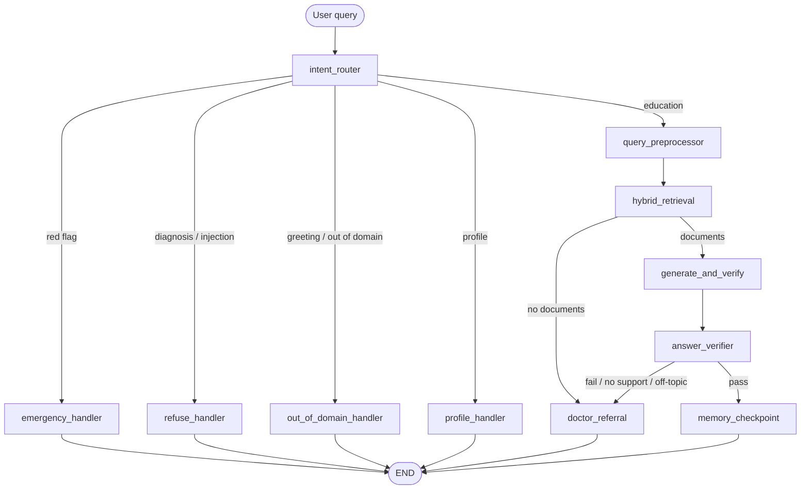

# LangGraph v2 — kiến trúc đang triển khai

Phiên bản này thay thế pipeline v1 nhiều bước bằng một luồng fail-closed, với
bốn LLM calls ở happy path: phân loại intent, tiền xử lý truy vấn, sinh đáp án,
và kiểm chứng grounding độc lập.

| Gate | Node | Trách nhiệm |
| --- | --- | --- |
| 1 | `intent_router` | Rule guardrail trước, sau đó fast LLM trả JSON `scope` + `task_kind`. Câu hỏi bữa ăn, vận động, theo dõi, tự chăm sóc và chuẩn bị khám đều là `in_scope` dù không nêu tên bệnh. Red flag, chẩn đoán, injection và OOD thật không vào retrieval. |
| 2 | `query_preprocessor` | Gộp coreference resolution, profile-aware rewrite, task-aware query expansion và trích routine có cấu trúc vào một LLM call; nhận sáu message gần nhất và routine memory bền vững. |
| 3 | `hybrid_retrieval` | Truy xuất tối đa 8 tài liệu, ưu tiên metadata bệnh chính trong hồ sơ khi có. Hiện backend là dense retrieval trên ChromaDB; tên node được giữ để tương thích API. |
| 4 | `generate_and_verify` | Một quality LLM tạo `<analysis>`, `<answer>`, `<verdict>`. Parser chỉ cho phép citation `[doc_N]` có trong context. |
| 5 | `answer_verifier` | Một quality LLM độc lập kiểm câu trả lời với câu hỏi gốc và cùng context. Nó fail-closed khi đổi chiều chỉ số, đổi ý nghĩa phân loại, sai trọng tâm hoặc không đủ grounding. |
| 6 | `memory_checkpoint` | Đánh dấu state đã hoàn tất; API lưu hội thoại sau khi graph trả về. |

## Safety contract

- Không có tài liệu, output sai format, thiếu citation, citation ngoài context,
  LLM lỗi, `no_support`, hoặc `answers_question=false` đều đi tới
  `doctor_referral`.
- `partially` chỉ được phát khi có ít nhất một citation hợp lệ và chứa cảnh báo
  inline.
- SSE không stream token raw của LLM. Token chỉ được phát sau khi toàn bộ graph
  hoàn tất, vì vậy người dùng không nhìn thấy draft chưa qua routing.
- Nhánh red flag không lưu query hoặc response vào bảng conversation/message.
- API lưu audit cho câu trả lời không khẩn cấp: truy vấn đã chuẩn hoá, danh sách
  chunk/điểm truy xuất, model/temperature generation và verdict verifier. Dữ liệu
  này chỉ nằm trong `messages.meta_data`, không trả ra giao diện bệnh nhân.

## Routine memory

- Mỗi lượt chat tải `patient_routine_memories` cùng với hồ sơ và sáu message
  gần nhất vào `AgentState`.
- `query_preprocessor` trích routine mới chỉ từ câu hỏi hiện tại. Nó phải đưa
  lại chính xác câu/cụm `evidence` của người bệnh; backend đối chiếu evidence
  với input trước khi lưu. LLM không thể tự tạo routine, thuốc hoặc chỉ số.
- Các loại được lưu: vận động, ăn uống, lịch dùng thuốc, lịch đo chỉ số, tự
  chăm sóc và giấc ngủ. Tối đa 24 facts/bệnh nhân; facts trùng chỉ được cập
  nhật thời điểm xác nhận.
- Routine được đưa vào cả preprocessing lẫn generation như **ngữ cảnh tự
  khai**, không phải nguồn y khoa. Nó không được dùng làm citation, không lấn
  át câu hỏi mới, hồ sơ bệnh hoặc tài liệu đã duyệt.

Routine extraction nằm bên trong `query_preprocessor`, thay vì thêm node/LLM
call riêng. Happy path dùng thêm một call duy nhất cho `answer_verifier`.

## Practical recommendations

`task_kind` mô tả loại việc bệnh nhân cần làm, không phải một danh sách keyword
trong code. Các giá trị hiện có gồm `meal_recommendation`, `activity_plan`,
`monitoring_plan`, `appointment_preparation`, `self_care_plan` và
`measurement_interpretation`.

Với yêu cầu gợi ý thực hành, preprocessing mở rộng câu hỏi đời thường thành
truy vấn y khoa theo hồ sơ; generation chỉ được ghép món/hành động khi thành
phần, cách làm và các hạn chế cần thiết đều có trong chunks. Hồ sơ/routine chỉ
cá nhân hoá, không được dùng làm nguồn. Thiếu grounding vẫn fail-closed về
`doctor_referral`.

Với `measurement_interpretation`, preprocessing giữ nguyên chiều câu hỏi (cao,
thấp, bình thường, mục tiêu hoặc chẩn đoán); generation và verifier chỉ chấp
nhận các ngưỡng đúng chiều và đúng điều kiện lấy mẫu/thời điểm có trong nguồn.
